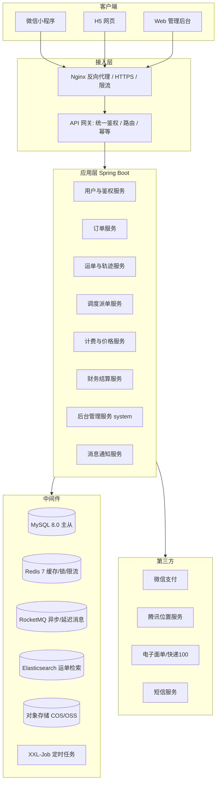
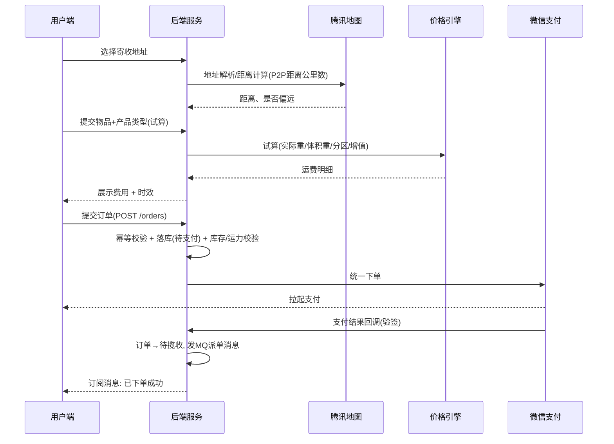
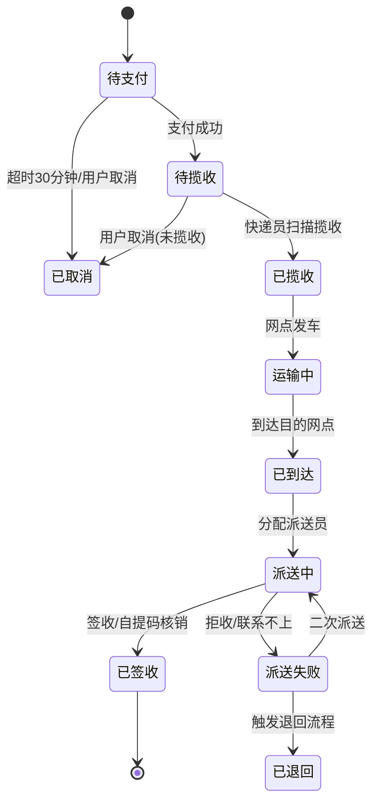
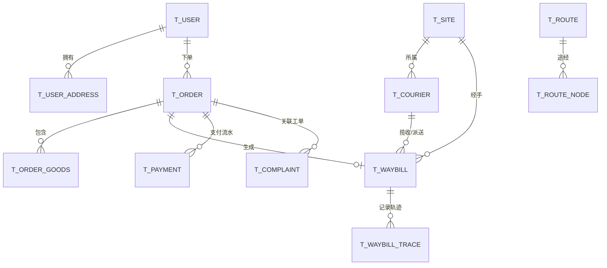

# 快递物流服务平台 开发文档

> 形态：微信小程序 + H5（同一套代码多端编译） · Web 管理后台 · 后端服务
> 参考产品形态：京东物流 / 顺丰速运 类综合快递平台

| 项 | 内容 |
| --- | --- |
| 文档版本 | v1.0（初稿） |
| 编写日期 | 2026-09-14 |
| 文档状态 | 待评审 |
| 适用范围 | 产品、前端、后端、测试、运维 |

## 修订记录

| 版本 | 日期 | 修订人 | 修订说明 |
| --- | --- | --- | --- |
| v1.0 | 2026-09-14 | — | 首版，覆盖需求、架构、数据库、接口、技术方案、排期 |

---

## 1. 项目概述

### 1.1 项目背景

面向 C 端个人用户与 B 端中小商户，提供一站式寄件、查件、收件服务；同时为企业内部运营人员提供完整的后台管理能力，覆盖订单、运单、网点、车辆、司机、线路、价格、财务对账、数据看板等环节。

### 1.2 产品定位

- **用户端**：让用户"3 步寄件、1 屏查件"。主打时效可视化与价格透明。
- **运营端**：让调度、网点、财务在一个后台完成全链路作业，减少 Excel 与线下沟通。
- **技术定位**：多端同构一套代码，降低小程序 / H5 双端维护成本。

### 1.3 目标用户与场景

| 角色 | 使用端 | 核心诉求 |
| --- | --- | --- |
| C 端寄件用户 | 小程序 / H5 | 快速下单、上门揽收、价格透明、实时轨迹 |
| C 端收件用户 | H5（分享链接） | 无需登录即可查件、代收点自提 |
| 网点操作员 | 后台 Web | 接单、分拣、扫描、交接 |
| 调度员 | 后台 Web | 智能派单、车辆排班、线路规划 |
| 快递员/司机 | 后台 Web（移动自适应） | 揽收任务、派送任务、批量签收 |
| 财务 | 后台 Web | 账单核对、运费结算、代收货款 |
| 平台管理员 | 后台 Web | 权限、参数、价格模板、日志审计 |

### 1.4 核心业务主线


### 1.5 名词术语

| 术语 | 含义 |
| --- | --- |
| 订单 Order | 用户下单产生的交易单据，含金额、支付、寄收信息 |
| 运单 Waybill | 实际承运包裹的物流单据，一个订单可拆多个运单 |
| 运单号 | 面向用户的物流单号（可对接电子面单） |
| 轨迹 Trace | 运单在各节点的扫描记录 |
| 控制点 | 运输线路上的中转站点 |
| 电子面单 | 打印在包裹上的标准化面单，含条码 |
| 首重/续重 | 计费规则，首个重量段 + 超出部分按单位计费 |
| 体积重 | 长×宽×高 ÷ 抛比系数，与实重取大值计费 |
| 代收货款 COD | 签收时向收件人收取货款 |

---

## 2. 需求分析

### 2.1 用户端功能清单（小程序 + H5）

优先级：**P0** 必须 / **P1** 重要 / **P2** 可延后

| 模块 | 功能点 | 优先级 | 说明 |
| --- | --- | --- | --- |
| 登录 | 微信授权登录 / 手机号验证码登录 | P0 | 小程序走 `wx.login` + `getPhoneNumber`；H5 走短信 |
| 登录 | 游客查件 | P1 | 凭运单号 + 手机号后 4 位查询 |
| 首页 | 寄件 / 查件 / 扫码 三大入口 | P0 | 顶部定位当前城市 |
| 首页 | 时效与价格速查 | P1 | 输入寄收地址出预估时效与价格 |
| 首页 | 我的常用地址/AI 智能填充 | P2 | 粘贴一段文字自动解析地址 |
| 寄件 | 寄件地址 / 收件地址（地址簿、地图选址、定位） | P0 | 腾讯地图选点，含省市区三级联动 |
| 寄件 | 物品信息（名称、类型、件数、重量、体积） | P0 | 违禁品校验 |
| 寄件 | 增值服务（保价、签收确认、代收货款、定时上门） | P1 | 保价按费率计 |
| 寄件 | 产品类型选择（标快、特快、经济、大件） | P0 | 不同产品不同时效与价格 |
| 寄件 | 运费试算 | P0 | 实时返回运费明细 |
| 寄件 | 上门时间选择（今天/明天，时间段） | P0 | 支持"尽快上门" |
| 寄件 | 支付（微信支付） | P0 | 小程序 JSAPI / H5 支付 |
| 寄件 | 下单成功页 + 分享 | P1 | 分享给收件人 |
| 查件 | 运单列表（按状态筛选） | P0 | 待付款/待揽收/运输中/已完成 |
| 查件 | 运单详情 + 时间轴轨迹 | P0 | 支持地图轨迹回放（P2） |
| 查件 | 派送员联系方式 / 一键拨打 | P0 | 虚拟号通话（P2） |
| 查件 | 修改地址 / 取消订单 / 催单 | P1 | 有条件限制 |
| 查件 | 电子面单/回单查看 | P2 | 图片预览 |
| 消息 | 订阅消息推送（揽收、派送、签收） | P1 | 小程序订阅消息 |
| 我的 | 地址簿管理（增删改、设默认） | P0 | 上限 20 条 |
| 我的 | 优惠券 / 余额 / 发票 | P1 | 发票可申请电子普票 |
| 我的 | 客服与投诉工单 | P1 | 提交工单 + 进度查询 |
| 我的 | 设置（隐私、注销账号） | P1 | 合规必备 |
| 代收点 | 附近驿站/自提点查询、自提码 | P2 | 地图 + 列表 |

### 2.2 管理后台功能清单

| 一级模块 | 二级功能 | 优先级 |
| --- | --- | --- |
| 首页看板 | 今日订单量/收入、各环节时效、异常预警、地图热力图 | P0 |
| 订单管理 | 订单列表、详情、改价、取消、手动补单、导出 | P0 |
| 运单管理 | 运单列表、轨迹详情、强制改单、退回、转寄 | P0 |
| 揽收管理 | 待揽收池、智能派单、手动指派、揽收超时预警 | P0 |
| 派送管理 | 派送任务分配、签收、拒收、二次派送、代收点投递 | P0 |
| 网点管理 | 网点 CRUD、服务范围（电子围栏）、营业时间、联系人 | P0 |
| 人员管理 | 快递员/司机档案、所属网点、接单上限、在职状态 | P0 |
| 车辆管理 | 车辆档案、年检/保险到期提醒、绑定司机 | P1 |
| 线路管理 | 线路配置（起点-终点-途经控制点-时效）、成本 | P1 |
| 运输管理 | 发车任务、装车扫描、到达扫描、交接单 | P1 |
| 价格管理 | 运费模板、分区、首重续重、体积重系数、增值服务费率 | P0 |
| 促销管理 | 优惠券、满减、新人券、活动配置 | P2 |
| 客户管理 | 企业客户、月结账户、授信额度、合同折扣 | P1 |
| 财务管理 | 支付流水、对账、运费结算、代收货款、发票、退款 | P0 |
| 工单管理 | 投诉/理赔/咨询工单、工单流转、SLA 超时 | P1 |
| 消息中心 | 短信/订阅消息模板、推送记录 | P1 |
| 系统管理 | 用户、角色、菜单、数据权限、字典、参数、操作日志 | P0 |
| 报表中心 | 经营报表、时效报表、网点绩效、导出 | P1 |

### 2.3 角色权限矩阵（摘要）

| 功能 | 超管 | 调度 | 网点 | 快递员 | 财务 | 客服 |
| --- | :-: | :-: | :-: | :-: | :-: | :-: |
| 订单查看 | ✅全部 | ✅全部 | ✅本网点 | ✅本人 | ✅全部 | ✅全部 |
| 订单改价/取消 | ✅ | ✅ | ✅本网点 | ❌ | ❌ | ✅申请 |
| 派单 | ✅ | ✅ | ✅本网点 | ❌ | ❌ | ❌ |
| 揽收/派送操作 | ✅ | ✅ | ✅ | ✅ | ❌ | ❌ |
| 价格模板配置 | ✅ | ❌ | ❌ | ❌ | ✅查看 | ❌ |
| 财务结算 | ✅ | ❌ | ❌ | ❌ | ✅ | ❌ |
| 系统管理 | ✅ | ❌ | ❌ | ❌ | ❌ | ❌ |

> 数据权限统一用「全部 / 本网点 / 本部门 / 仅本人」四档模型实现（见 8.4）。

---

## 3. 总体架构设计

### 3.1 架构分层



### 3.2 技术选型

| 层 | 选型 | 版本 | 选型理由 |
| --- | --- | --- | --- |
| 小程序/H5 | **Taro 4 + React 18 + TypeScript** | 4.x | 一套代码编译微信小程序 + H5，生态成熟，H5 适配好；备选 uni-app（Vue 系团队） |
| 小程序/UI | Taroify 或 NutUI-Taro | 最新 | 移动端组件丰富，体积可控 |
| 状态管理 | Zustand（Taro 端友好） | 4.x | 轻量，TS 友好 |
| 后台前端 | **Vue 3 + TypeScript + Vite 5** | — | 国内后台主流；备选 React 18 + Ant Design 5 |
| 后台 UI | Element Plus + Pinia + Vue Router | — | 组件齐全，表格/表单能力强 |
| 图表 | ECharts 5 | — | 看板报表 |
| 后端 | **Java 17 + Spring Boot 3.2** | — | 长事务、状态机成熟；备选 NestJS + TypeORM |
| 数据访问 | MyBatis-Plus 3.5 | — | 单表 CRUD 快，复杂 SQL 可控 |
| 数据库 | MySQL 8.0（InnoDB / utf8mb4） | 8.0.3x | 主从 + 读写分离 |
| 缓存 | Redis 7 | 7.x | 缓存、分布式锁、限流、队列 |
| 消息队列 | RocketMQ 5（或 RabbitMQ） | — | 延迟消息（超时取消）、削峰 |
| 检索 | Elasticsearch 8（可选） | — | 运单/轨迹海量检索 |
| 定时任务 | XXL-Job | 2.4 | 可视化调度 |
| 权限 | Sa-Token（或 Spring Security + JWT） | — | 轻量易用 |
| 接口文档 | Knife4j / springdoc-openapi | — | 在线调试 |
| 对象存储 | 腾讯云 COS / 阿里云 OSS | — | 图片、面单、证件 |
| 地图 | 腾讯位置服务 | — | 小程序原生坐标系 gcj02 友好 |
| 部署 | Docker + Docker Compose（起步）→ K8s（扩容） | — | 平滑演进 |
| CI/CD | GitLab CI 或 Jenkins + Harbor | — | 多环境发布 |

### 3.3 架构演进策略

**起步阶段采用「模块化单体」**：单工程多模块（Maven Multi-Module），按业务分包，接口边界清晰；当订单/运单量达到瓶颈（如日均 10 万单以上）再按模块拆分为微服务。避免过早微服务化带来的运维成本。

```
logistics-parent
├── logistics-common        公共：统一响应、异常、工具、常量
├── logistics-api           对外 API 层（Controller + DTO）
├── logistics-service       业务逻辑层
├── logistics-dao           数据访问层（Mapper + Entity）
├── logistics-job           定时任务
├── logistics-admin         后台管理模块
└── logistics-boot          启动模块（配置、打包）
```

---

## 4. 功能详细设计

### 4.1 用户端页面结构

```
pages/
├── home/index              首页（寄件/查件/扫码）
├── order/
│   ├── create/index        填写寄收信息
│   ├── goods/index         物品信息
│   ├── value-added/index   增值服务
│   ├── time/index          上门时间
│   ├── confirm/index       订单确认 + 费用明细
│   └── pay-result/index    支付结果
├── address/
│   ├── list/index          地址簿
│   ├── edit/index          新增/编辑地址
│   └── map-picker/index    地图选址
├── waybill/
│   ├── list/index          运单列表
│   ├── detail/index        运单详情（轨迹时间轴）
│   ├── modify/index        修改地址
│   └── share/index         分享查件页
├── message/list            消息中心
├── mine/
│   ├── index               我的
│   ├── coupon              优惠券
│   ├── invoice             发票
│   └── settings            设置/隐私/注销
└── service/
    ├── complaint           投诉工单
    └── station             附近代收点
```

### 4.2 下单核心流程（时序）



### 4.3 运单状态机



### 4.4 状态字典

| 订单状态 | 值 | 说明 |
| --- | --- | --- |
| UNPAID | 0 | 待支付 |
| PENDING_PICKUP | 10 | 待揽收 |
| PICKED_UP | 20 | 已揽收 |
| IN_TRANSIT | 30 | 运输中 |
| ARRIVED | 35 | 到达目的网点 |
| DELIVERING | 40 | 派送中 |
| SIGNED | 50 | 已签收 |
| CANCELLED | 60 | 已取消 |
| EXCEPTION | 70 | 异常（滞留、破损、退回） |

---

## 5. 数据库设计

### 5.1 设计规范

- 引擎 `InnoDB`，字符集 `utf8mb4`，排序 `utf8mb4_0900_ai_ci`。
- 统一字段：`id BIGINT UNSIGNED AUTO_INCREMENT`、`create_time`、`update_time`、`creator`、`updater`、`deleted TINYINT`（逻辑删除）。
- 金额一律 `DECIMAL(12,2)`，禁止 float/double；重量 `DECIMAL(10,3)` kg；体积 `DECIMAL(10,4)` m³。
- 手机号加密存储（AES-256-GCM），另存 `phone_hash` 用于检索。
- 时间统一 `DATETIME`，服务端存储 UTC+8，前端按本地时区展示。
- 大表（`t_waybill_trace`、`t_order`）按 `create_time` 月度分表或按 `site_id` 分库（二期）。

### 5.2 核心 ER 关系



### 5.3 核心表 DDL

```sql
-- 用户表
CREATE TABLE `t_user` (
  `id`           BIGINT UNSIGNED NOT NULL AUTO_INCREMENT,
  `open_id`      VARCHAR(64)  NOT NULL COMMENT '微信 openid',
  `union_id`     VARCHAR(64)  DEFAULT NULL COMMENT '微信 unionid',
  `nickname`     VARCHAR(64)  DEFAULT NULL,
  `avatar`       VARCHAR(512) DEFAULT NULL,
  `phone`        VARBINARY(128) DEFAULT NULL COMMENT 'AES 加密手机号',
  `phone_hash`   CHAR(64)     DEFAULT NULL COMMENT '手机号哈希,用于检索',
  `customer_type` TINYINT     NOT NULL DEFAULT 1 COMMENT '1个人 2企业',
  `status`       TINYINT      NOT NULL DEFAULT 1 COMMENT '1正常 0禁用',
  `create_time`  DATETIME     NOT NULL DEFAULT CURRENT_TIMESTAMP,
  `update_time`  DATETIME     NOT NULL DEFAULT CURRENT_TIMESTAMP ON UPDATE CURRENT_TIMESTAMP,
  `deleted`      TINYINT      NOT NULL DEFAULT 0,
  PRIMARY KEY (`id`),
  UNIQUE KEY `uk_openid` (`open_id`),
  KEY `idx_phone_hash` (`phone_hash`)
) ENGINE=InnoDB DEFAULT CHARSET=utf8mb4 COMMENT='用户表';

-- 地址簿
CREATE TABLE `t_user_address` (
  `id`          BIGINT UNSIGNED NOT NULL AUTO_INCREMENT,
  `user_id`     BIGINT UNSIGNED NOT NULL,
  `contact_name` VARCHAR(64)  NOT NULL COMMENT '联系人',
  `contact_phone` VARBINARY(128) NOT NULL COMMENT '加密手机号',
  `province`    VARCHAR(32)  NOT NULL,
  `city`        VARCHAR(32)  NOT NULL,
  `district`    VARCHAR(32)  NOT NULL,
  `street`      VARCHAR(64)  DEFAULT NULL,
  `detail`      VARCHAR(255) NOT NULL COMMENT '详细地址',
  `lng`         DECIMAL(10,6) DEFAULT NULL,
  `lat`         DECIMAL(10,6) DEFAULT NULL,
  `poi_id`      VARCHAR(64)  DEFAULT NULL COMMENT '地图 POI ID',
  `tag`         VARCHAR(16)  DEFAULT NULL COMMENT '家/公司',
  `is_default`  TINYINT      NOT NULL DEFAULT 0,
  `create_time` DATETIME     NOT NULL DEFAULT CURRENT_TIMESTAMP,
  `update_time` DATETIME     NOT NULL DEFAULT CURRENT_TIMESTAMP ON UPDATE CURRENT_TIMESTAMP,
  `deleted`     TINYINT      NOT NULL DEFAULT 0,
  PRIMARY KEY (`id`),
  KEY `idx_user` (`user_id`,`is_default`)
) ENGINE=InnoDB DEFAULT CHARSET=utf8mb4 COMMENT='用户地址簿';

-- 订单主表
CREATE TABLE `t_order` (
  `id`             BIGINT UNSIGNED NOT NULL AUTO_INCREMENT,
  `order_no`       VARCHAR(32)  NOT NULL COMMENT '订单号',
  `user_id`        BIGINT UNSIGNED NOT NULL,
  `product_code`   VARCHAR(16)  NOT NULL COMMENT '产品:EXPRESS标快/FAST特快/ECO经济/BULKY大件',
  `status`         TINYINT      NOT NULL DEFAULT 0 COMMENT '见状态字典',
  `sender_name`    VARCHAR(64)  NOT NULL,
  `sender_phone`   VARBINARY(128) NOT NULL,
  `sender_addr`    VARCHAR(255) NOT NULL,
  `sender_lng`     DECIMAL(10,6) DEFAULT NULL,
  `sender_lat`     DECIMAL(10,6) DEFAULT NULL,
  `receiver_name`  VARCHAR(64)  NOT NULL,
  `receiver_phone` VARBINARY(128) NOT NULL,
  `receiver_addr`  VARCHAR(255) NOT NULL,
  `receiver_lng`   DECIMAL(10,6) DEFAULT NULL,
  `receiver_lat`   DECIMAL(10,6) DEFAULT NULL,
  `distance_km`    DECIMAL(10,2) DEFAULT NULL COMMENT '计费距离',
  `weight`         DECIMAL(10,3) DEFAULT NULL COMMENT '实际重量kg',
  `volume_weight`  DECIMAL(10,3) DEFAULT NULL COMMENT '体积重kg',
  `charge_weight`  DECIMAL(10,3) DEFAULT NULL COMMENT '计费重量kg',
  `goods_count`    INT          NOT NULL DEFAULT 1 COMMENT '件数',
  `freight_amount` DECIMAL(12,2) NOT NULL DEFAULT 0 COMMENT '运费',
  `insured_amount` DECIMAL(12,2) NOT NULL DEFAULT 0 COMMENT '保价费',
  `other_amount`   DECIMAL(12,2) NOT NULL DEFAULT 0 COMMENT '其他增值费',
  `discount_amount` DECIMAL(12,2) NOT NULL DEFAULT 0 COMMENT '优惠',
  `pay_amount`     DECIMAL(12,2) NOT NULL DEFAULT 0 COMMENT '应付总额',
  `cod_amount`     DECIMAL(12,2) NOT NULL DEFAULT 0 COMMENT '代收货款',
  `pickup_start`   DATETIME     DEFAULT NULL COMMENT '预约上门开始',
  `pickup_end`     DATETIME     DEFAULT NULL COMMENT '预约上门结束',
  `pay_time`       DATETIME     DEFAULT NULL,
  `cancel_reason`  VARCHAR(255) DEFAULT NULL,
  `remark`         VARCHAR(255) DEFAULT NULL,
  `create_time`    DATETIME     NOT NULL DEFAULT CURRENT_TIMESTAMP,
  `update_time`    DATETIME     NOT NULL DEFAULT CURRENT_TIMESTAMP ON UPDATE CURRENT_TIMESTAMP,
  `deleted`        TINYINT      NOT NULL DEFAULT 0,
  PRIMARY KEY (`id`),
  UNIQUE KEY `uk_order_no` (`order_no`),
  KEY `idx_user_status` (`user_id`,`status`,`create_time`),
  KEY `idx_status_create` (`status`,`create_time`),
  KEY `idx_receiver_phone` (`receiver_phone`(64))
) ENGINE=InnoDB DEFAULT CHARSET=utf8mb4 COMMENT='订单主表';

-- 订单物品明细
CREATE TABLE `t_order_goods` (
  `id`          BIGINT UNSIGNED NOT NULL AUTO_INCREMENT,
  `order_id`    BIGINT UNSIGNED NOT NULL,
  `goods_name`  VARCHAR(128) NOT NULL COMMENT '物品名称',
  `category`    VARCHAR(32)  DEFAULT NULL COMMENT '物品类型',
  `quantity`    INT          NOT NULL DEFAULT 1,
  `weight`      DECIMAL(10,3) DEFAULT NULL,
  `length`      DECIMAL(10,2) DEFAULT NULL COMMENT 'cm',
  `width`       DECIMAL(10,2) DEFAULT NULL,
  `height`      DECIMAL(10,2) DEFAULT NULL,
  `unit_price`  DECIMAL(12,2) DEFAULT NULL COMMENT '申报价值',
  `create_time` DATETIME     NOT NULL DEFAULT CURRENT_TIMESTAMP,
  PRIMARY KEY (`id`),
  KEY `idx_order` (`order_id`)
) ENGINE=InnoDB DEFAULT CHARSET=utf8mb4 COMMENT='订单物品明细';

-- 运单表
CREATE TABLE `t_waybill` (
  `id`             BIGINT UNSIGNED NOT NULL AUTO_INCREMENT,
  `waybill_no`     VARCHAR(32)  NOT NULL COMMENT '运单号(对用户展示)',
  `order_id`       BIGINT UNSIGNED NOT NULL,
  `status`         TINYINT      NOT NULL DEFAULT 0 COMMENT '与订单状态一致',
  `origin_site_id` BIGINT UNSIGNED DEFAULT NULL COMMENT '始发网点',
  `dest_site_id`   BIGINT UNSIGNED DEFAULT NULL COMMENT '目的网点',
  `pickup_courier_id` BIGINT UNSIGNED DEFAULT NULL COMMENT '揽收员',
  `deliver_courier_id` BIGINT UNSIGNED DEFAULT NULL COMMENT '派送员',
  `current_site_id` BIGINT UNSIGNED DEFAULT NULL COMMENT '当前所在网点',
  `label_url`      VARCHAR(512) DEFAULT NULL COMMENT '电子面单图片',
  `pickup_time`    DATETIME     DEFAULT NULL,
  `arrive_time`    DATETIME     DEFAULT NULL,
  `deliver_time`   DATETIME     DEFAULT NULL,
  `sign_time`      DATETIME     DEFAULT NULL,
  `sign_type`      TINYINT      DEFAULT NULL COMMENT '1本人 2代收点 3他人代签',
  `create_time`    DATETIME     NOT NULL DEFAULT CURRENT_TIMESTAMP,
  `update_time`    DATETIME     NOT NULL DEFAULT CURRENT_TIMESTAMP ON UPDATE CURRENT_TIMESTAMP,
  `deleted`        TINYINT      NOT NULL DEFAULT 0,
  PRIMARY KEY (`id`),
  UNIQUE KEY `uk_waybill_no` (`waybill_no`),
  KEY `idx_order` (`order_id`),
  KEY `idx_status_site` (`status`,`current_site_id`),
  KEY `idx_deliver_courier` (`deliver_courier_id`,`status`)
) ENGINE=InnoDB DEFAULT CHARSET=utf8mb4 COMMENT='运单表';

-- 运单轨迹（写入量大，预留分表）
CREATE TABLE `t_waybill_trace` (
  `id`          BIGINT UNSIGNED NOT NULL AUTO_INCREMENT,
  `waybill_no`  VARCHAR(32)  NOT NULL,
  `site_id`     BIGINT UNSIGNED DEFAULT NULL COMMENT '操作网点',
  `operator_id` BIGINT UNSIGNED DEFAULT NULL COMMENT '操作人',
  `status`      TINYINT      NOT NULL COMMENT '节点状态码',
  `trace_desc`  VARCHAR(255) NOT NULL COMMENT '对外文案:已到达【北京朝阳网点】',
  `lng`         DECIMAL(10,6) DEFAULT NULL,
  `lat`         DECIMAL(10,6) DEFAULT NULL,
  `scan_time`   DATETIME     NOT NULL COMMENT '扫描时间',
  `create_time` DATETIME     NOT NULL DEFAULT CURRENT_TIMESTAMP,
  PRIMARY KEY (`id`),
  KEY `idx_waybill_time` (`waybill_no`,`scan_time`)
) ENGINE=InnoDB DEFAULT CHARSET=utf8mb4 COMMENT='运单轨迹';

-- 网点
CREATE TABLE `t_site` (
  `id`           BIGINT UNSIGNED NOT NULL AUTO_INCREMENT,
  `site_code`    VARCHAR(32)  NOT NULL,
  `site_name`    VARCHAR(64)  NOT NULL,
  `site_type`    TINYINT      NOT NULL DEFAULT 1 COMMENT '1营业网点 2分拨中心 3代收点',
  `parent_id`    BIGINT UNSIGNED DEFAULT NULL,
  `province`     VARCHAR(32)  NOT NULL,
  `city`         VARCHAR(32)  NOT NULL,
  `district`     VARCHAR(32)  NOT NULL,
  `address`      VARCHAR(255) NOT NULL,
  `lng`          DECIMAL(10,6) DEFAULT NULL,
  `lat`          DECIMAL(10,6) DEFAULT NULL,
  `fence`        TEXT         DEFAULT NULL COMMENT '电子围栏 GeoJSON',
  `contact_name` VARCHAR(64)  DEFAULT NULL,
  `contact_phone` VARCHAR(32) DEFAULT NULL,
  `business_hours` VARCHAR(64) DEFAULT NULL,
  `status`       TINYINT      NOT NULL DEFAULT 1,
  `create_time`  DATETIME     NOT NULL DEFAULT CURRENT_TIMESTAMP,
  `update_time`  DATETIME     NOT NULL DEFAULT CURRENT_TIMESTAMP ON UPDATE CURRENT_TIMESTAMP,
  `deleted`      TINYINT      NOT NULL DEFAULT 0,
  PRIMARY KEY (`id`),
  UNIQUE KEY `uk_site_code` (`site_code`),
  KEY `idx_city` (`city`,`district`)
) ENGINE=InnoDB DEFAULT CHARSET=utf8mb4 COMMENT='网点';

-- 快递员/司机
CREATE TABLE `t_courier` (
  `id`            BIGINT UNSIGNED NOT NULL AUTO_INCREMENT,
  `courier_no`    VARCHAR(32)  NOT NULL COMMENT '工号',
  `real_name`     VARCHAR(64)  NOT NULL,
  `phone`         VARBINARY(128) NOT NULL,
  `id_card`       VARBINARY(256) DEFAULT NULL COMMENT '加密身份证',
  `site_id`       BIGINT UNSIGNED NOT NULL,
  `role_type`     TINYINT      NOT NULL DEFAULT 1 COMMENT '1快递员 2司机 3分拣员',
  `max_task`      INT          NOT NULL DEFAULT 50 COMMENT '最大同时在途任务数',
  `service_area`  TEXT         DEFAULT NULL COMMENT '服务区域 GeoJSON',
  `status`        TINYINT      NOT NULL DEFAULT 1 COMMENT '1在职 0离职',
  `create_time`   DATETIME     NOT NULL DEFAULT CURRENT_TIMESTAMP,
  `update_time`   DATETIME     NOT NULL DEFAULT CURRENT_TIMESTAMP ON UPDATE CURRENT_TIMESTAMP,
  `deleted`       TINYINT      NOT NULL DEFAULT 0,
  PRIMARY KEY (`id`),
  UNIQUE KEY `uk_courier_no` (`courier_no`),
  KEY `idx_site_status` (`site_id`,`status`)
) ENGINE=InnoDB DEFAULT CHARSET=utf8mb4 COMMENT='配送人员';

-- 线路与线路节点
CREATE TABLE `t_route` (
  `id`            BIGINT UNSIGNED NOT NULL AUTO_INCREMENT,
  `route_code`    VARCHAR(32)  NOT NULL,
  `route_name`    VARCHAR(64)  NOT NULL,
  `start_site_id` BIGINT UNSIGNED NOT NULL,
  `end_site_id`   BIGINT UNSIGNED NOT NULL,
  `trans_type`    TINYINT      NOT NULL DEFAULT 1 COMMENT '1陆运 2空运 3铁路',
  `aging_hours`   INT          NOT NULL COMMENT '标准时效(小时)',
  `cost_amount`   DECIMAL(12,2) DEFAULT NULL COMMENT '线路成本',
  `status`        TINYINT      NOT NULL DEFAULT 1,
  `create_time`   DATETIME     NOT NULL DEFAULT CURRENT_TIMESTAMP,
  `update_time`   DATETIME     NOT NULL DEFAULT CURRENT_TIMESTAMP ON UPDATE CURRENT_TIMESTAMP,
  `deleted`       TINYINT      NOT NULL DEFAULT 0,
  PRIMARY KEY (`id`),
  UNIQUE KEY `uk_route_code` (`route_code`),
  KEY `idx_start_end` (`start_site_id`,`end_site_id`)
) ENGINE=InnoDB DEFAULT CHARSET=utf8mb4 COMMENT='运输线路';

CREATE TABLE `t_route_node` (
  `id`         BIGINT UNSIGNED NOT NULL AUTO_INCREMENT,
  `route_id`   BIGINT UNSIGNED NOT NULL,
  `site_id`    BIGINT UNSIGNED NOT NULL,
  `seq`        INT          NOT NULL COMMENT '顺序号,从0开始',
  `stay_min`   INT          NOT NULL DEFAULT 0 COMMENT '停留分钟',
  PRIMARY KEY (`id`),
  UNIQUE KEY `uk_route_seq` (`route_id`,`seq`)
) ENGINE=InnoDB DEFAULT CHARSET=utf8mb4 COMMENT='线路途经节点';

-- 运费模板与规则
CREATE TABLE `t_price_template` (
  `id`            BIGINT UNSIGNED NOT NULL AUTO_INCREMENT,
  `template_name` VARCHAR(64)  NOT NULL,
  `product_code`  VARCHAR(16)  NOT NULL,
  `volume_ratio`  INT          NOT NULL DEFAULT 6000 COMMENT '体积重抛比系数',
  `effective_time` DATETIME    DEFAULT NULL,
  `expire_time`   DATETIME     DEFAULT NULL,
  `status`        TINYINT      NOT NULL DEFAULT 1 COMMENT '1启用 0停用',
  `create_time`   DATETIME     NOT NULL DEFAULT CURRENT_TIMESTAMP,
  `update_time`   DATETIME     NOT NULL DEFAULT CURRENT_TIMESTAMP ON UPDATE CURRENT_TIMESTAMP,
  `deleted`       TINYINT      NOT NULL DEFAULT 0,
  PRIMARY KEY (`id`)
) ENGINE=InnoDB DEFAULT CHARSET=utf8mb4 COMMENT='运费模板';

CREATE TABLE `t_price_rule` (
  `id`             BIGINT UNSIGNED NOT NULL AUTO_INCREMENT,
  `template_id`    BIGINT UNSIGNED NOT NULL,
  `origin_province` VARCHAR(32) NOT NULL,
  `dest_province`  VARCHAR(32) NOT NULL,
  `dest_city`      VARCHAR(32)  DEFAULT NULL COMMENT '同省可细化到市',
  `zone_no`        VARCHAR(16)  DEFAULT NULL COMMENT '分区号',
  `first_weight`   DECIMAL(10,3) NOT NULL DEFAULT 1 COMMENT '首重kg',
  `first_price`    DECIMAL(12,2) NOT NULL COMMENT '首重价',
  `add_step`       DECIMAL(10,3) NOT NULL DEFAULT 1 COMMENT '续重步长kg',
  `add_price`      DECIMAL(12,2) NOT NULL COMMENT '续重单价',
  `min_charge`     DECIMAL(12,2) DEFAULT NULL COMMENT '起步价',
  `remote_flag`    TINYINT      NOT NULL DEFAULT 0 COMMENT '是否偏远地区',
  `create_time`    DATETIME     NOT NULL DEFAULT CURRENT_TIMESTAMP,
  PRIMARY KEY (`id`),
  KEY `idx_lookup` (`template_id`,`origin_province`,`dest_province`)
) ENGINE=InnoDB DEFAULT CHARSET=utf8mb4 COMMENT='运费计费规则';

-- 支付流水
CREATE TABLE `t_payment` (
  `id`            BIGINT UNSIGNED NOT NULL AUTO_INCREMENT,
  `trade_no`      VARCHAR(64)  NOT NULL COMMENT '平台交易号',
  `order_no`      VARCHAR(32)  NOT NULL,
  `channel`       VARCHAR(16)  NOT NULL COMMENT 'WXPAY/ALIPAY/BALANCE',
  `out_trade_no`  VARCHAR(64)  DEFAULT NULL COMMENT '第三方交易号',
  `amount`        DECIMAL(12,2) NOT NULL,
  `direction`     TINYINT      NOT NULL DEFAULT 1 COMMENT '1收入 -1退款',
  `status`        TINYINT      NOT NULL DEFAULT 0 COMMENT '0待支付 1成功 2失败 3已退款',
  `pay_time`      DATETIME     DEFAULT NULL,
  `create_time`   DATETIME     NOT NULL DEFAULT CURRENT_TIMESTAMP,
  `update_time`   DATETIME     NOT NULL DEFAULT CURRENT_TIMESTAMP ON UPDATE CURRENT_TIMESTAMP,
  PRIMARY KEY (`id`),
  UNIQUE KEY `uk_trade_no` (`trade_no`),
  KEY `idx_order_no` (`order_no`),
  KEY `idx_create_time` (`create_time`)
) ENGINE=InnoDB DEFAULT CHARSET=utf8mb4 COMMENT='支付流水';

-- 投诉/理赔工单
CREATE TABLE `t_complaint` (
  `id`           BIGINT UNSIGNED NOT NULL AUTO_INCREMENT,
  `ticket_no`    VARCHAR(32)  NOT NULL,
  `waybill_no`   VARCHAR(32)  DEFAULT NULL,
  `user_id`      BIGINT UNSIGNED NOT NULL,
  `type`         TINYINT      NOT NULL COMMENT '1咨询 2投诉 3理赔 4改址',
  `content`      TEXT         NOT NULL,
  `images`       VARCHAR(1024) DEFAULT NULL COMMENT '图片URL,逗号分隔',
  `status`       TINYINT      NOT NULL DEFAULT 0 COMMENT '0待处理 1处理中 2已解决 3已关闭',
  `handler_id`   BIGINT UNSIGNED DEFAULT NULL,
  `handle_result` VARCHAR(500) DEFAULT NULL,
  `expect_time`  DATETIME     DEFAULT NULL COMMENT 'SLA 截止时间',
  `create_time`  DATETIME     NOT NULL DEFAULT CURRENT_TIMESTAMP,
  `update_time`  DATETIME     NOT NULL DEFAULT CURRENT_TIMESTAMP ON UPDATE CURRENT_TIMESTAMP,
  PRIMARY KEY (`id`),
  UNIQUE KEY `uk_ticket_no` (`ticket_no`),
  KEY `idx_user` (`user_id`),
  KEY `idx_status_expect` (`status`,`expect_time`)
) ENGINE=InnoDB DEFAULT CHARSET=utf8mb4 COMMENT='服务工单';
```

### 5.4 后台权限相关表

```sql
CREATE TABLE `t_sys_user` (
  `id`          BIGINT UNSIGNED NOT NULL AUTO_INCREMENT,
  `username`    VARCHAR(64)  NOT NULL,
  `password`    VARCHAR(128) NOT NULL COMMENT 'BCrypt',
  `real_name`   VARCHAR(64)  DEFAULT NULL,
  `phone`       VARCHAR(32)  DEFAULT NULL,
  `site_id`     BIGINT UNSIGNED DEFAULT NULL COMMENT '所属网点(数据权限)',
  `dept_id`     BIGINT UNSIGNED DEFAULT NULL,
  `status`      TINYINT      NOT NULL DEFAULT 1,
  `last_login_time` DATETIME DEFAULT NULL,
  `create_time` DATETIME     NOT NULL DEFAULT CURRENT_TIMESTAMP,
  `update_time` DATETIME     NOT NULL DEFAULT CURRENT_TIMESTAMP ON UPDATE CURRENT_TIMESTAMP,
  `deleted`     TINYINT      NOT NULL DEFAULT 0,
  PRIMARY KEY (`id`),
  UNIQUE KEY `uk_username` (`username`)
) ENGINE=InnoDB DEFAULT CHARSET=utf8mb4 COMMENT='后台用户';

CREATE TABLE `t_sys_role` (
  `id`          BIGINT UNSIGNED NOT NULL AUTO_INCREMENT,
  `role_code`   VARCHAR(64)  NOT NULL,
  `role_name`   VARCHAR(64)  NOT NULL,
  `data_scope`  TINYINT      NOT NULL DEFAULT 1 COMMENT '1全部 2本网点 3本部门 4仅本人',
  `status`      TINYINT      NOT NULL DEFAULT 1,
  `create_time` DATETIME     NOT NULL DEFAULT CURRENT_TIMESTAMP,
  `deleted`     TINYINT      NOT NULL DEFAULT 0,
  PRIMARY KEY (`id`),
  UNIQUE KEY `uk_role_code` (`role_code`)
) ENGINE=InnoDB DEFAULT CHARSET=utf8mb4 COMMENT='角色';

CREATE TABLE `t_sys_menu` (
  `id`         BIGINT UNSIGNED NOT NULL AUTO_INCREMENT,
  `parent_id`  BIGINT UNSIGNED NOT NULL DEFAULT 0,
  `menu_name`  VARCHAR(64)  NOT NULL,
  `menu_type`  TINYINT      NOT NULL COMMENT '1目录 2菜单 3按钮',
  `perms`      VARCHAR(128) DEFAULT NULL COMMENT '权限标识 order:edit',
  `path`       VARCHAR(128) DEFAULT NULL,
  `component`  VARCHAR(128) DEFAULT NULL,
  `icon`       VARCHAR(64)  DEFAULT NULL,
  `sort`       INT          NOT NULL DEFAULT 0,
  `visible`    TINYINT      NOT NULL DEFAULT 1,
  `create_time` DATETIME    NOT NULL DEFAULT CURRENT_TIMESTAMP,
  PRIMARY KEY (`id`)
) ENGINE=InnoDB DEFAULT CHARSET=utf8mb4 COMMENT='菜单权限';

CREATE TABLE `t_sys_user_role` (
  `user_id` BIGINT UNSIGNED NOT NULL,
  `role_id` BIGINT UNSIGNED NOT NULL,
  PRIMARY KEY (`user_id`,`role_id`)
) ENGINE=InnoDB DEFAULT CHARSET=utf8mb4 COMMENT='用户角色关联';

CREATE TABLE `t_sys_role_menu` (
  `role_id` BIGINT UNSIGNED NOT NULL,
  `menu_id` BIGINT UNSIGNED NOT NULL,
  PRIMARY KEY (`role_id`,`menu_id`)
) ENGINE=InnoDB DEFAULT CHARSET=utf8mb4 COMMENT='角色菜单关联';

CREATE TABLE `t_operation_log` (
  `id`          BIGINT UNSIGNED NOT NULL AUTO_INCREMENT,
  `user_id`     BIGINT UNSIGNED DEFAULT NULL,
  `username`    VARCHAR(64)  DEFAULT NULL,
  `module`      VARCHAR(64)  DEFAULT NULL COMMENT '模块',
  `operation`   VARCHAR(128) DEFAULT NULL COMMENT '操作描述',
  `method`      VARCHAR(255) DEFAULT NULL,
  `params`      TEXT         DEFAULT NULL,
  `ip`          VARCHAR(64)  DEFAULT NULL,
  `cost_ms`     INT          DEFAULT NULL,
  `success`     TINYINT      NOT NULL DEFAULT 1,
  `error_msg`   VARCHAR(500) DEFAULT NULL,
  `create_time` DATETIME     NOT NULL DEFAULT CURRENT_TIMESTAMP,
  PRIMARY KEY (`id`),
  KEY `idx_user_time` (`user_id`,`create_time`)
) ENGINE=InnoDB DEFAULT CHARSET=utf8mb4 COMMENT='操作日志';
```

### 5.5 其他表清单

| 表名 | 说明 |
| --- | --- |
| `t_vehicle` | 车辆档案（车牌、类型、载重、年检/保险到期） |
| `t_transport_task` | 发车任务（线路、车辆、司机、装车件数、状态） |
| `t_transport_task_item` | 发车任务与运单关联（交接明细） |
| `t_pickup_task` | 揽收任务（指派、超时、结果） |
| `t_deliver_task` | 派送任务（指派、签收方式、结果） |
| `t_coupon` / `t_user_coupon` | 优惠券模板与用户券 |
| `t_invoice` | 发票申请记录 |
| `t_settlement` | 结算单（客户/网点/快递员维度） |
| `t_bill_detail` | 结算明细 |
| `t_message_template` | 消息模板（短信/订阅消息） |
| `t_message_record` | 消息发送记录 |
| `t_dict_type` / `t_dict_data` | 数据字典 |
| `t_config` | 系统参数（键值对） |
| `t_station_package` | 代收点入库包裹、自提码 |

---

## 6. 接口设计

### 6.1 通用规范

**Base URL**：`https://api.xxx.com/api/v1`（用户端）/ `https://api.xxx.com/admin/v1`（后台）

**统一响应体**

```json
{
  "code": 0,
  "message": "success",
  "data": {},
  "traceId": "a1b2c3d4e5f6"
}
```

| code | 含义 |
| --- | --- |
| 0 | 成功 |
| 400 | 参数校验失败 |
| 401 | 未登录 / token 失效 |
| 403 | 无权限 |
| 409 | 业务冲突（重复下单、状态不允许） |
| 429 | 请求过于频繁 |
| 500 | 服务端异常 |
| 1001~ | 业务错误码（如 1001 订单不存在、1002 运单不可取消） |

**请求头**

| Header | 说明 |
| --- | --- |
| `Authorization` | `Bearer <JWT>` |
| `X-Client` | `mini` / `h5` / `admin` |
| `X-Request-Id` | 客户端生成，用于链路追踪 |
| `X-Sign` / `X-Timestamp` | 敏感接口签名（可选） |

**分页请求/响应**

```json
{ "pageNum": 1, "pageSize": 20, "sortField": "create_time", "sortOrder": "desc" }
{ "list": [], "total": 128, "pageNum": 1, "pageSize": 20 }
```

**幂等**：下单、支付回调、扫码节点接口必须幂等。下单使用 `userId + 客户端幂等 token`，扫码使用 `运单号 + 状态 + 业务时间戳` 做唯一约束。

### 6.2 用户端接口清单

| # | 方法 | 路径 | 说明 | 鉴权 |
| --- | --- | --- | --- | --- |
| 1 | POST | `/auth/wx-login` | 微信 code 换 token | 否 |
| 2 | POST | `/auth/sms-code` | 发送短信验证码 | 否 |
| 3 | POST | `/auth/sms-login` | 短信验证码登录 | 否 |
| 4 | POST | `/auth/phone-bind` | 绑定微信手机号 | 是 |
| 5 | POST | `/auth/refresh` | 刷新 token | 是 |
| 6 | GET | `/user/profile` | 用户信息 | 是 |
| 7 | POST | `/user/logout` | 退出登录 | 是 |
| 8 | POST | `/user/cancel-account` | 注销账号（合规） | 是 |
| 9 | GET | `/addresses` | 地址列表 | 是 |
| 10 | POST | `/addresses` | 新增地址 | 是 |
| 11 | PUT | `/addresses/{id}` | 编辑地址 | 是 |
| 12 | DELETE | `/addresses/{id}` | 删除地址 | 是 |
| 13 | GET | `/addresses/default` | 默认地址 | 是 |
| 14 | GET | `/map/suggest` | 地址联想（腾讯地图代理） | 是 |
| 15 | POST | `/map/geocode` | 逆地理编码 | 是 |
| 16 | GET | `/products` | 产品类型列表 | 否 |
| 17 | GET | `/price/calc` | 运费试算 | 否 |
| 18 | GET | `/price/time` | 时效预估 | 否 |
| 19 | POST | `/orders` | 创建订单 | 是 |
| 20 | GET | `/orders/{orderNo}` | 订单详情 | 是 |
| 21 | GET | `/orders` | 我的订单列表 | 是 |
| 22 | POST | `/orders/{orderNo}/cancel` | 取消订单 | 是 |
| 23 | POST | `/orders/{orderNo}/pay` | 发起支付 | 是 |
| 24 | GET | `/orders/{orderNo}/pay-status` | 支付结果查询 | 是 |
| 25 | GET | `/waybills` | 运单列表 | 是 |
| 26 | GET | `/waybills/{waybillNo}` | 运单详情 | 是 |
| 27 | GET | `/waybills/{waybillNo}/traces` | 轨迹列表 | 是 |
| 28 | GET | `/waybills/{waybillNo}/track-map` | 地图轨迹 | 是 |
| 29 | POST | `/waybills/query` | 游客查件（单号+手机后4位） | 否 |
| 30 | POST | `/waybills/{waybillNo}/urge` | 催单 | 是 |
| 31 | POST | `/waybills/{waybillNo}/modify-address` | 修改收件地址 | 是 |
| 32 | GET | `/waybills/{waybillNo}/label` | 电子面单 | 是 |
| 33 | POST | `/pay/wx/notify` | 微信支付回调 | 否 |
| 34 | POST | `/pay/wx/refund` | 申请退款 | 是 |
| 35 | GET | `/coupons` | 可用优惠券 | 是 |
| 36 | POST | `/invoices` | 申请发票 | 是 |
| 37 | POST | `/complaints` | 提交工单 | 是 |
| 38 | GET | `/complaints` | 工单列表 | 是 |
| 39 | GET | `/stations/nearby` | 附近代收点 | 是 |
| 40 | GET | `/message/list` | 消息列表 | 是 |

### 6.3 后台接口清单（摘要）

| 模块 | 接口 |
| --- | --- |
| 登录 | `POST /admin/auth/login`、`POST /admin/auth/logout`、`GET /admin/auth/userinfo`、`GET /admin/auth/routers` |
| 订单 | `GET /admin/orders`（多条件分页）、`GET /admin/orders/{no}`、`PUT /admin/orders/{no}/price`、`PUT /admin/orders/{no}/cancel`、`POST /admin/orders/{no}/reassign`、`GET /admin/orders/export` |
| 运单 | `GET /admin/waybills`、`GET /admin/waybills/{no}`、`POST /admin/waybills/{no}/trace`（手动补录轨迹）、`PUT /admin/waybills/{no}/transfer`（转寄） |
| 揽收 | `GET /admin/pickup-tasks`、`POST /admin/pickup-tasks/auto-dispatch`、`PUT /admin/pickup-tasks/{id}/assign`、`PUT /admin/pickup-tasks/{id}/finish` |
| 派送 | `GET /admin/deliver-tasks`、`PUT /admin/deliver-tasks/{id}/assign`、`PUT /admin/deliver-tasks/{id}/sign`、`PUT /admin/deliver-tasks/{id}/fail` |
| 网点 | `GET/POST/PUT/DELETE /admin/sites`、`GET /admin/sites/{id}/fence` |
| 人员 | `GET/POST/PUT /admin/couriers`、`PUT /admin/couriers/{id}/status` |
| 车辆 | `GET/POST/PUT /admin/vehicles` |
| 线路 | `GET/POST/PUT /admin/routes`、`PUT /admin/routes/{id}/nodes` |
| 运输 | `GET /admin/transport-tasks`、`POST /admin/transport-tasks`（发车）、`PUT /admin/transport-tasks/{id}/load`（装车扫描）、`PUT /admin/transport-tasks/{id}/arrive` |
| 价格 | `GET/POST/PUT /admin/price-templates`、`GET/POST/PUT /admin/price-rules`、`POST /admin/price/trial`（后台试算） |
| 财务 | `GET /admin/payments`、`GET /admin/settlements`、`POST /admin/settlements/generate`、`PUT /admin/settlements/{id}/confirm`、`GET /admin/invoices` |
| 工单 | `GET /admin/complaints`、`PUT /admin/complaints/{id}/handle` |
| 看板 | `GET /admin/dashboard/overview`、`GET /admin/dashboard/trend`、`GET /admin/dashboard/site-rank`、`GET /admin/dashboard/exception` |
| 系统 | 用户/角色/菜单/字典/参数/日志 标准 CRUD |

### 6.4 关键接口示例

**运费试算**

```
GET /api/v1/price/calc?originProvince=北京市&originCity=北京市
    &destProvince=广东省&destCity=深圳市&weight=5.2
    &length=40&width=30&height=20&productCode=EXPRESS&insuredAmount=1000
```

```json
{
  "code": 0,
  "data": {
    "productCode": "EXPRESS",
    "productName": "标快",
    "chargeWeight": 6.0,
    "volumeWeight": 4.0,
    "agingHours": 36,
    "agingText": "预计 09-16 18:00 前送达",
    "feeDetail": [
      { "name": "首重(1kg)", "amount": 12.00 },
      { "name": "续重(5kg)", "amount": 10.00 },
      { "name": "保价费(1000元)", "amount": 5.00 }
    ],
    "totalAmount": 27.00
  }
}
```

**创建订单**

```json
POST /api/v1/orders
{
  "idempotentToken": "uuid-xxxx",
  "productCode": "EXPRESS",
  "sender": {
    "name": "张三", "phone": "13800000000",
    "province": "北京市", "city": "北京市", "district": "朝阳区",
    "detail": "望京SOHO T1 20层", "lng": 116.480, "lat": 39.996
  },
  "receiver": {
    "name": "李四", "phone": "13900000000",
    "province": "广东省", "city": "深圳市", "district": "南山区",
    "detail": "科技园路 1 号", "lng": 113.95, "lat": 22.53
  },
  "goods": [{ "name": "文件", "quantity": 1, "weight": 0.5 }],
  "insuredAmount": 1000,
  "codAmount": 0,
  "pickupStart": "2026-09-15 09:00:00",
  "pickupEnd": "2026-09-15 11:00:00",
  "remark": "请电话联系"
}
```

响应：

```json
{ "code": 0, "data": { "orderNo": "JD20260915XXXXXX", "payAmount": 27.00, "status": 0 } }
```

---

## 7. 关键技术方案

### 7.1 多端同构（小程序 + H5）

- 使用 **Taro 4 + React 18 + TS**，通过 `process.env.TARO_ENV` 做条件编译：
  - 登录：小程序走 `Taro.login` + `getPhoneNumber`；H5 走短信验证码。
  - 支付：小程序走 `Taro.requestPayment`；H5 走 `Taro.requestPayment`（JSAPI，需公众号授权）。
  - 定位：小程序 `Taro.getLocation`；H5 使用腾讯地图 JS SDK 的 geolocation。
  - 分享：小程序 `useShareAppMessage`；H5 复制链接 + 生成小程序码。
- 平台差异统一封装在 `src/platform/*.ts`，业务代码只调用抽象接口：

```ts
// src/platform/index.ts
export interface PlatformAdapter {
  login(): Promise<string>;
  getPhone(): Promise<string>;
  pay(params: PayParams): Promise<void>;
  getLocation(): Promise<{ lng: number; lat: number }>;
  share(payload: SharePayload): void;
}
```

- H5 部署：静态资源上传 CDN，`index.html` 设置 `Cache-Control: no-cache`，JS/CSS 带 hash 长缓存。
- 小程序分包：主包只放首页/查件，`order`、`mine`、`service` 拆分包，主包体积控制 < 1.5MB。

### 7.2 H5 移动端适配方案

| 项 | 方案 |
| --- | --- |
| 视口 | `<meta name="viewport" content="width=device-width,initial-scale=1,maximum-scale=1,user-scalable=no,viewport-fit=cover">` |
| 尺寸单位 | 设计稿 375px 基准，`postcss-px-to-viewport` 转 `vw`（Taro H5 端 `pxtransform` 配置 `unitPrecision: 5`） |
| 安全区 | 底部按钮 `padding-bottom: calc(12px + env(safe-area-inset-bottom))` |
| 1px 边框 | `transform: scaleY(0.5)` 伪元素方案 |
| 图片 | 统一 WebP + 懒加载，列表图 750px 宽以内 |
| 滚动穿透 | 弹层打开时给 body 加 `overflow: hidden` |
| 兼容 | 目标 iOS 12+ / Android 8+ / 微信内置浏览器 X5 内核，使用 `autoprefixer` + `browserslist` |

### 7.3 运费计算引擎

**计费公式**

```
体积重(kg) = 长(cm) × 宽(cm) × 高(cm) ÷ 抛比系数      默认 6000（空运）/ 8000（陆运）
计费重量   = max(实际重量, 体积重)，向上取整到 0.5kg 或 1kg（按规则配置）
基础运费   = 首重价 + ceil((计费重量 - 首重) / 续重步长) × 续重单价
保价费     = 保价金额 × 费率（默认 0.5%，最低 1 元）
偏远附加   = 规则中 remote_flag=1 时按固定额或比例加收
COD 手续费 = 代收货款 × 费率（默认 1%，最低 2 元）
应付总额   = max(基础运费 + 保价费 + 附加费 + 手续费 - 优惠, 起步价)
```

**实现要点**

1. 规则优先匹配「同省同城 → 同省 → 跨省」逐级回退。
2. 计费规则全量加载进 Redis（`price:rule:{templateId}`），本地 Caffeine + Redis 二级缓存，规则变更时通过 MQ 广播失效。
3. 分区（zone）与偏远地区用「省 + 市」双字段索引，避免逐条遍历。
4. 价格试算与下单使用同一套引擎，保证「所见即所得」；下单时快照计费参数写入订单（`weight/charge_weight/freight_amount`），避免后续规则变更影响历史订单。
5. 全部金额用 `BigDecimal`，`RoundingMode.HALF_UP`，保留 2 位。

### 7.4 智能派单

初版用**规则引擎**，二期引入打分模型：

```
候选快递员 = 同网点 + 在职 + 当前在途任务 < max_task + 服务范围包含寄件点
score = 0.4 × 距离得分 + 0.3 × 负载得分 + 0.2 × 揽收及时率 + 0.1 × 用户好评率
```

- 距离计算使用 Redis GEO（`GEOADD courier:pos`，快递员 App 上报位置，或按网点坐标近似）。
- 派单用 RocketMQ 延迟消息实现「N 分钟未接单自动改派」，延迟级别 5m/10m/20m。
- 派单结果落库 `t_pickup_task`，并提供后台手动改派入口。

### 7.5 运单轨迹与实时推送

| 能力 | 方案 |
| --- | --- |
| 轨迹采集 | 快递员端扫码：揽收/到站/发车/派送/签收，逐节点写入 `t_waybill_trace` |
| 轨迹同步 | 若走第三方承运，XXL-Job 每 30 分钟调用第三方查询接口增量同步 |
| 用户查询 | `GET /waybills/{no}/traces` 走 Redis 缓存（TTL 5 分钟），无则查库回填 |
| 状态推送 | 小程序订阅消息（揽收/派送/签收三个模板）；H5 用短信 + 服务号模板消息 |
| 实时性 | 状态变更 → 发 MQ → 消息服务异步推送，主链路不阻塞 |
| 地图轨迹 | 存节点经纬度，前端用腾讯地图 polyline 串联；正式点位用快递员上报 |

### 7.6 电子面单对接

- 优先对接**第三方聚合平台**（快递100 / 菜鸟 / 丰桥）降低对接成本，二期再直连各家。
- 流程：下单成功 → 调用下单接口取 `waybill_no` + `print_data`（加密串）→ 生成面单图片/PDF 存 OSS → 用户端与后台可预览下载。
- 打印方案：
  - 网点：云打印 API（对接打印机厂商）或「菜鸟组件 + 本地控件」。
  - 兜底：后端用 `PDFBox` 按模板渲染三合一/一联单 PDF，支持批量下载。
- 面单取消：订单取消时调用第三方 `cancel` 接口，需处理「已打印不可取消」的业务分支。

### 7.7 定时任务清单

| 任务 | 频率 | 说明 |
| --- | --- | --- |
| 订单超时未支付自动取消 | 每分钟 | 扫描 `status=0` 且超 30 分钟 |
| 揽收超时预警 | 每 10 分钟 | 超过预约时间 2 小时未揽收，通知网点 |
| 派送超时预警 | 每小时 | 超过时效未签收，推送调度 |
| 轨迹同步 | 每 30 分钟 | 第三方运单轨迹增量拉取 |
| 车辆证照到期提醒 | 每天 09:00 | 年检/保险 30 天内到期 |
| 自动确认收货 | 每天 01:00 | 签收后 7 天自动完结 |
| 结算单生成 | 每月 1 日 02:00 | 生成上月客户/网点结算单 |
| 数据看板预聚合 | 每小时 | 汇总订单量、收入、时效指标 |
| 消息重推 | 每 5 分钟 | 推送失败的订阅消息/短信重试 3 次 |

### 7.8 缓存与性能设计

| 场景 | 策略 |
| --- | --- |
| 运费规则 | Caffeine 本地缓存（60s）+ Redis，MQ 广播失效 |
| 网点/产品/字典 | Redis 永久缓存 + 后台修改主动刷新 |
| 运单轨迹 | Redis 缓存 5 分钟；大运单（>100 条轨迹）分页返回 |
| 用户会话 | JWT 无状态 + Redis 存黑名单（登出/踢下线） |
| 热点运单 | 路由到读库；订单写入走主库，查询走从库（读写分离） |
| 大列表查询 | 强制分页，最大 pageSize=100；导出走异步任务 + 下载中心 |
| 限流 | Redis + 令牌桶：单用户 20 QPS，登录接口 5 次/分钟，短信 1 次/60s |
| 分布式锁 | Redisson，锁「订单状态流转」「派单」关键路径 |

**性能目标**：接口 P95 < 300ms，查询类 < 200ms，下单链路 < 800ms；支持 500 QPS 峰值、日均 15 万单。

### 7.9 安全设计

| 风险 | 措施 |
| --- | --- |
| 越权访问 | 所有查询强制带 `userId` 条件；后台用 `@DataScope` 按网点过滤 |
| 敏感数据 | 手机号/身份证 AES-256-GCM 加密入库，展示脱敏（138****0000） |
| 支付安全 | 回调验签 + 金额二次校验 + 幂等表防重放 |
| 接口防刷 | 网关限流 + 短信图形验证码 + 设备指纹（风控二期） |
| SQL 注入 | MyBatis `#{}` 参数绑定，禁止 `${}` 拼接 |
| XSS | 富文本白名单过滤，前端输出转义 |
| 会话安全 | JWT 有效期 2h + refresh token 7d；后台密码 BCrypt + 登录失败 5 次锁定 10 分钟 |
| 数据合规 | 隐私政策、用户协议、账号注销、数据导出（《个人信息保护法》） |
| 传输安全 | 全站 HTTPS，TLS 1.2+，HSTS |
| 审计 | 后台所有写操作记录 `t_operation_log` |

### 7.10 部署架构

```
                      ┌──────────────┐
  用户/管理端  ──────▶ │  CDN + WAF   │
                      └──────┬───────┘
                             │
                      ┌──────▼───────┐
                      │ Nginx (LB)   │  HTTPS / gzip / 静态资源
                      └──────┬───────┘
                             │
                 ┌───────────┴───────────┐
                 │  Spring Boot 实例 x2  │  (Docker)
                 └───────────┬───────────┘
                             │
     ┌───────────┬───────────┼───────────┬───────────┐
  MySQL主从    Redis哨兵   RocketMQ    Elasticsearch  对象存储
```

| 环境 | 用途 | 配置建议 |
| --- | --- | --- |
| dev | 开发自测 | 单机 Docker Compose |
| test | 测试/联调 | 2C4G × 2 |
| staging | 预发，数据脱敏 | 与生产同构，缩容 |
| prod | 生产 | 应用 4C8G × 3，MySQL 4C16G 主从，Redis 4G 主从 |

- 容器化：Dockerfile 多阶段构建（JDK 17 基础镜像），镜像推 Harbor。
- CI/CD：Git 推送 → 单测 → 构建 → 镜像 → 部署 test → 审批 → 部署 prod。
- 监控：Prometheus + Grafana（JVM/接口指标）、SkyWalking（链路追踪）、ELK（日志）、企业微信告警。
- 数据库变更：Flyway 版本化管理，禁止手工改生产表结构。

---

## 8. 开发规范

### 8.1 分支与提交

| 分支 | 用途 |
| --- | --- |
| `main` | 生产分支，只接受 release 合并 |
| `develop` | 集成分支 |
| `feature/xxx` | 功能开发 |
| `hotfix/xxx` | 线上紧急修复 |

提交信息遵循 **Conventional Commits**：`feat: 新增运费试算接口` / `fix: 修复订单超时取消重复触发`。

### 8.2 前后端协作

- 接口先行：先定 OpenAPI（Knife4j / YApi），前端用 Mock 并行开发。
- 字段命名统一 `camelCase`；时间统一 `yyyy-MM-dd HH:mm:ss`。
- 所有枚举值在后端维护为字典，前端通过字典接口获取，禁止前后端各自硬编码。

### 8.3 编码规范

- 后端：阿里 Java 开发手册，Controller 不写业务、Service 不写 SQL、Mapper 不写逻辑。
- 前端：ESLint + Prettier + Stylelint；TS 开启 `strict`；组件不超过 300 行。
- 命名：数据库 `snake_case`，Java 类 `UpperCamelCase`，方法变量 `lowerCamelCase`。

### 8.4 数据权限实现要点

```java
// 注解 + AOP，在 SQL 上追加数据权限条件
@DataScope(siteAlias = "s", userAlias = "u")
public Page<OrderVO> pageOrders(OrderQuery q) { ... }
```

- `data_scope=1` 全部：不追加条件。
- `data_scope=2` 本网点：追加 `AND s.site_id IN (当前用户可见网点)`。
- `data_scope=4` 仅本人：追加 `AND o.user_id = #{userId}`。

---

## 9. 项目计划

> 以下为参考排期，实际以团队人力与需求评审结果为准。

| 阶段 | 交付内容 | 参考工期 |
| --- | --- | --- |
| M0 需求与设计 | 需求确认、原型、UI 设计、数据库设计、接口定义 | 1.5 周 |
| M1 基础框架 | 前后端工程搭建、登录鉴权、权限体系、CI/CD | 1.5 周 |
| M2 下单与计费 | 地址簿、地图选址、运费引擎、下单、后台价格配置 | 2.5 周 |
| M3 支付与运单 | 微信支付、订单状态机、电子面单、运单轨迹 | 2.5 周 |
| M4 运营后台 | 订单/揽收/派送/网点/人员/车辆/线路管理 | 3 周 |
| M5 财务与报表 | 支付流水、对账结算、发票、数据看板 | 2 周 |
| M6 联调测试 | 全链路联调、压测、安全测试、Bug 修复 | 2 周 |
| M7 上线 | 灰度发布、监控告警、试运行 | 1 周 |

**建议团队配置**：产品 1 · UI 1 · 前端 2 · 后端 3 · 测试 1 · 运维 0.5

**里程碑验收标准**

- M2：可在小程序完成一次完整下单并正确出价。
- M3：支付成功后可查到运单与轨迹，订阅消息可收到。
- M4：后台可完成「接单 → 派单 → 揽收 → 发车 → 到达 → 派送 → 签收」全流程操作。
- M6：核心接口 P95 < 300ms，500 并发压测无错误，主要流程用例通过率 100%。

---

## 10. 风险与对策

| 风险 | 影响 | 对策 |
| --- | --- | --- |
| 电子面单/承运商接口申请周期长 | 阻塞 M3 | M1 阶段即启动资质申请；准备「自编运单号 + 自印面单」降级方案 |
| 微信支付/小程序类目审核 | 影响上线 | 提前准备快递类目资质，预留审核时间 |
| 地图 API 配额与费用 | 成本上升 | 前端限流 + 服务端缓存 geocode 结果；评估配额包 |
| 运费规则复杂导致算错价 | 客诉与损失 | 规则单元测试覆盖全部分区；上线前用历史订单回归校验；后台提供试算工具 |
| 轨迹数据量大 | 查询变慢、存储膨胀 | 按月分表；冷数据归档到 OSS/ClickHouse；列表首屏只返回最近 5 条 |
| 并发下单/派单竞态 | 重复派单、状态错乱 | Redisson 分布式锁 + 状态机校验 + 唯一索引兜底 |
| 需求蔓延 | 工期失控 | 严格按 P0/P1/P2 分期，P2 明确放入二期 |
| 三方承运轨迹延迟 | 用户体验差 | 前端展示「数据更新中」兜底文案；后台可手工补录 |

---

## 11. 二期规划（Out of Scope，本期不做）

- 智能定价与动态折扣、AI 预测时效
- 无人车/无人机配送调度
- 国际件与报关
- 驿站加盟商独立结算体系
- 用户端地图实时轨迹回放
- 风控系统（设备指纹、黄牛识别）
- 数据仓库 + BI 自助分析

---

## 12. 附录

### 12.1 环境与账号清单（待补充）

| 项 | 说明 |
| --- | --- |
| 微信小程序 AppID | 待申请 |
| 微信支付商户号 | 待申请 |
| 腾讯位置服务 Key | 待申请 |
| 电子面单服务商账号 | 待申请 |
| 短信服务商 | 待选型 |
| 域名与备案 | 待备案 |

### 12.2 待确认问题

1. 是**自建运力**（自有网点+快递员）还是**对接第三方承运**？这直接决定后台模块的侧重点。
2. 是否需要在 H5 中支持**公众号支付**（需要认证服务号 + JSAPI 支付授权）？
3. 是否有**企业客户月结**需求（本期 P1 还是二期）？
4. 是否需要**多租户/多品牌**（一套系统服务多个加盟商）？
5. 小程序与 H5 的**分享链路**是否需要生成小程序码？

---

*文档结束 · 有疑问或需要补充的模块（如 UI 原型说明、测试用例、运维手册）可在此文档基础上继续扩展。*
