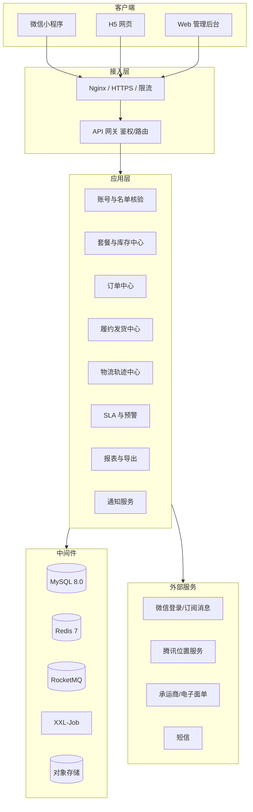
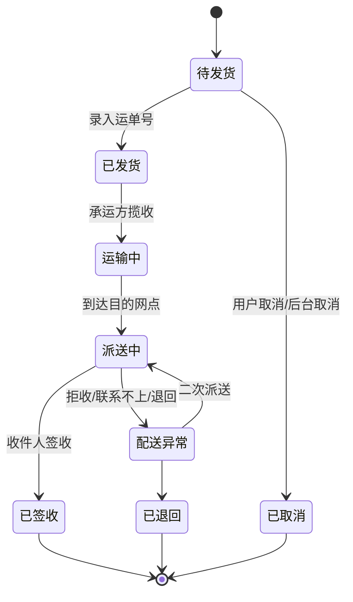
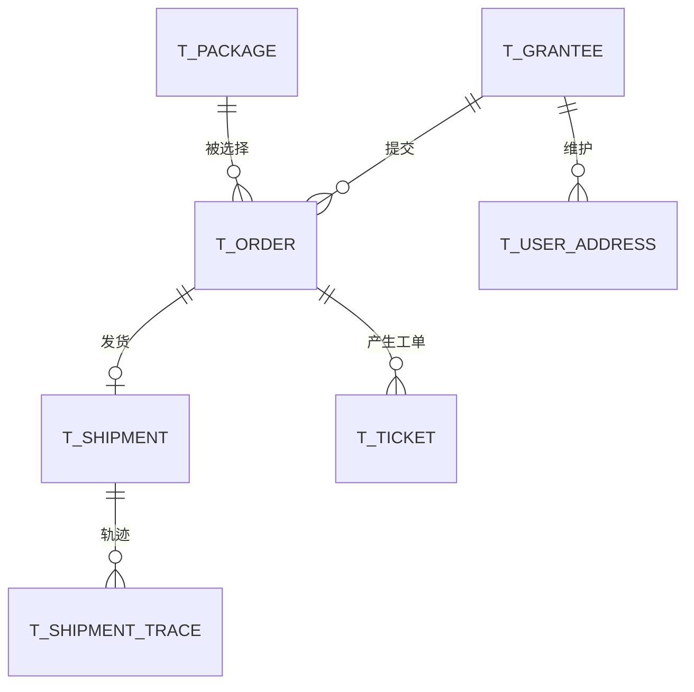

# 华中商贸配送中心 —— 慰问品线上选购与配送管理平台 开发文档

> **本文件已由 [`华中商贸配送中心-开发文档-v4.0.md`](./华中商贸配送中心-开发文档-v4.0.md) 补充实现部分。**
> v4.0 新增：后端工程实现、完整接口清单、Excel 导入导出规范、三角色权限模型、Docker 本地与服务器部署手册、验证记录。
> v3.0 保留作为**业务方案设计**依据（招标条款映射、页面结构、字段口径），可与 v4.0 对照阅读。

> 形态：微信小程序（适配 H5）· Web 管理后台 · 后端服务
> 业务主体：华中商贸配送中心（慰问品供货与配送履约方）

| 项 | 内容 |
| --- | --- |
| 文档版本 | v3.0 |
| 编写日期 | 2026-09-15 |
| 文档状态 | 待评审 |
| 依据文件 | 招标文件 2.1.2「供货期限及地点」条款 |
| 历史版本 | v1.0 综合快递平台、v2.0 聚合配送平台（均已归档至 `docs/archive/`） |

## 修订记录

| 版本 | 日期 | 修订说明 |
| --- | --- | --- |
| v1.0 | 2026-09-14 | 综合快递平台，含自建运费引擎与微信支付（已废弃） |
| v2.0 | 2026-09-15 | 聚合配送平台，核心为第三方运力渠道对接（部分保留） |
| **v3.0** | 2026-09-15 | **按招标条款重新定位**：慰问品套餐线上选购 + 教职工配送信息采集 + 10 日内发货履约 + 全国包邮送达入户。新增名单核验、套餐管理、履约 SLA 监控、报表导出等模块 |

---

## 1. 项目概述

### 1.1 项目背景

华中商贸配送中心承接「教职工慰问品」项目的供货与配送履约。按招标文件要求，需通过微信小程序等线上方式，统计所有领取慰问品的教职工的**配送信息**与**选购的套餐种类、数量**，并在收到信息后 **10 日内**完成快递发货，配送范围为**全国**，且必须**送达入户、未经允许不得放置代收点**。

本平台即为该履约动作的支撑系统，一端面向**教职工**采集选购与配送信息，一端面向**项目运营团队**完成汇总、发货、跟踪与统计。

### 1.2 招标条款 → 系统功能映射（合规追溯表）

> 本表是全项目的验收基准。每一条招标要求都必须有明确的功能落地点，且可被验证。

| # | 招标条款原文（要点） | 系统落地功能 | 验收方式 |
| --- | --- | --- | --- |
| 1 | 快递配送到家（或收货人指定地点） | 配送信息采集时**地址必须详细到门牌号**（前端强校验，禁止只填到小区/写字楼）；下单同步给承运方"送货上门"标记 | 抽查 50 单地址完整率 100% |
| 2 | 通过微信小程序、手机 APP 等方式**线上统计**配送信息及套餐种类、数量 | C 端：身份核验 → 选套餐 → 选数量 → 填配送信息 → 提交；后台：订单实时汇总，支持按单位/套餐/地区多维统计 | 演示端到端下单 + 后台统计口径核对 |
| 3 | 保证提供的方案货品充足 | 套餐**库存管理** + 库存预警 + 超卖拦截（下单即扣减，取消回补） | 库存为 0 时下单被拦截 |
| 4 | 不允许私自更改方案内容 | 套餐内容在 C 端**只读展示**；后台修改需留痕（操作日志 + 版本记录）；订单保存**套餐快照**，后续改套餐不影响已下单记录 | 后台改套餐后，历史订单展示不变 |
| 5 | 收到信息后应及时快递发货 | 提交成功后自动进入**待发货池**，生成发货任务 | 后台可见待发货列表 |
| 6 | 配送范围为全国范围内 | 地址库覆盖全国省市区（港澳台及个别地区按说明处理）；不设地域限制 | 用偏远地区地址下单成功 |
| 7 | **发货时间为收到信息后 10 日内** | **SLA 倒计时引擎**：下单成功即开始计时，第 7 天黄灯预警，第 8 天橙灯，第 10 天红灯超时告警并推送负责人 | 看板实时显示剩余天数分布 |
| 8 | 保证快递上楼到家入户 | 配送单携带"**上楼入户**"标记，同步至承运方备注；面单可打印该标记 | 发货数据中标记透传 |
| 9 | 未经收货人允许不得放置快递代收点 | C 端配送信息中提供**代收点授权开关，默认「不允许」**；该授权结果写入配送单并同步承运方 | 默认值为"不允许"且可查 |
| 10 | 除个别有说明的地区外（包邮） | 全站**包邮**标识；偏远地区（新疆/西藏/内蒙古部分区域等）在「配送说明」页单独公示时效差异 | 页面公示内容存在且可维护 |

### 1.3 项目范围

**本期做**

- C 端小程序（微信小程序 + H5）：身份核验、套餐选购、配送信息采集、订单与物流查询、地址簿、消息通知
- Web 管理后台：数据看板、教职工名单、套餐与库存、订单汇总、发货管理（含批量导入运单号）、物流跟踪、SLA 监控、报表导出、系统管理
- 后端服务：账号体系、订单中心、库存中心、履约中心、物流轨迹、通知服务
- 承运方对接：电子面单/运单号回填 + 物流轨迹查询（渠道适配器，承接 v2.0 设计）

**本期不做（明确排除）**

- ❌ 在线支付（本项目为集中采购发放，不向教职工收款）
- ❌ 自建运费计算引擎（全国包邮，不做计价）
- ❌ 商城式营销（优惠券、拼团、积分）
- ❌ 用户自建商品（套餐由后台统一配置，用户只能选不能改）

### 1.4 角色定义

| 角色 | 使用端 | 核心诉求 |
| --- | --- | --- |
| 教职工（领取人） | 小程序 / H5 | 快速选套餐、填地址、知道什么时候能收到 |
| 收件人（可能是家属/他人） | 无需登录（凭链接/单号查询） | 查看物流、联系配送 |
| 项目运营 | 后台 Web | 汇总订单、安排发货、盯住 10 天时限 |
| 客服 | 后台 Web | 处理地址修改、物流异常、投诉工单 |
| 管理员 | 后台 Web | 名单导入、套餐配置、权限与日志 |

### 1.5 名词术语

| 术语 | 含义 |
| --- | --- |
| 套餐 Package | 后台配置的慰问品组合方案，含内容清单与规格，用户只能选择不能修改 |
| 领取人 Grantee | 名单内的教职工，通过身份核验后获得选购资格 |
| 领取额度 Quota | 每人可领取的份数（默认 1 份，可按单位/人群配置） |
| 配送单 Shipment | 一次实际发货记录，含承运商、运单号、发货时间 |
| SLA | 招标要求的 10 日发货时限，系统按下单时间起算 |
| 上楼入户 | 承运方必须送达至收件人门牌的履约标记 |
| 代收点授权 | 收件人是否同意将包裹投放至快递代收点，**默认不同意** |

---

## 2. 需求分析

### 2.1 C 端小程序功能清单

优先级：**P0** 必须 / **P1** 重要 / **P2** 可延后

| 模块 | 功能点 | 优先级 |
| --- | --- | --- |
| 身份核验 | 微信授权登录（小程序）；手机号验证码登录（H5） | P0 |
| 身份核验 | **名单比对**：手机号/工号必须命中导入名单，否则提示"您不在本次领取名单中" | P0 |
| 身份核验 | 核验通过后展示领取资格：所属单位、可领份数、剩余份数 | P0 |
| 首页 | 品牌区 + 领取进度（未选/已选/已发货/已签收） | P0 |
| 首页 | 办理流程说明（选套餐 → 填配送信息 → 等待发货 → 送达入户） | P0 |
| 首页 | 配送说明公示：全国包邮、10 日内发货、送达入户、偏远地区说明 | P0 |
| 套餐 | 套餐列表（图片、名称、内容清单摘要、规格） | P0 |
| 套餐 | 套餐详情（内容清单明细只读展示 + 服务承诺） | P0 |
| 套餐 | 数量选择（受领取额度限制，超出即拦截并提示） | P0 |
| 套餐 | 库存状态展示（售罄置灰，不可选） | P0 |
| 配送信息 | 收货人姓名、手机号 | P0 |
| 配送信息 | 省 / 市 / 区 + **详细地址（强制到门牌，最少 8 字）** | P0 |
| 配送信息 | 地图选点（辅助定位，减少填错） | P1 |
| 配送信息 | **代收点授权开关（默认关闭 = 不允许放代收点）** | P0 |
| 配送信息 | 配送时间偏好（工作日/周末收货，备注） | P1 |
| 配送信息 | 地址簿：新增、编辑、删除、设默认、一键选用 | P0 |
| 订单 | 提交订单（含套餐快照、地址快照、SLA 起算时间） | P0 |
| 订单 | 订单列表（全部 / 待发货 / 已发货 / 已完成） | P0 |
| 订单 | 订单详情：套餐内容、配送信息、**发货倒计时**、物流轨迹 | P0 |
| 订单 | 地址修改（**未发货前**可改；已发货只能联系客服） | P0 |
| 订单 | 取消订单（未发货前可取消，回补库存与额度） | P1 |
| 订单 | 物流查询（对接承运方轨迹）、一键联系配送员 | P0 |
| 订单 | 签收确认 / 未收到投诉入口 | P1 |
| 消息 | 订阅消息推送：提交成功、已发货、派送中、已签收 | P0 |
| 我的 | 我的领取记录、地址簿、所属单位信息 | P0 |
| 我的 | 客服与工单、常见问题、隐私政策与账号注销 | P1 |

### 2.2 管理后台功能清单

| 一级模块 | 二级功能 | 优先级 |
| --- | --- | --- |
| 数据看板 | 应领/已领/未领人数、订单总数、套餐分布 | P0 |
| 数据看板 | **SLA 看板**：距 10 日时限的剩余天数分布（安全/预警/紧急/超时） | P0 |
| 数据看板 | 发货进度、签收率、异常单数、地区分布热力图 | P1 |
| 教职工名单 | Excel 导入（工号、姓名、手机号、单位、部门、可领份数） | P0 |
| 教职工名单 | 名单查询、编辑、停用、领取状态追踪、导出 | P0 |
| 套餐管理 | 套餐 CRUD、内容清单维护、图片上传 | P0 |
| 套餐管理 | 库存设置、库存预警阈值、上下架 | P0 |
| 套餐管理 | **变更留痕**：修改历史可查（对应"不允许私自更改方案内容"） | P0 |
| 订单管理 | 多条件查询（单位/套餐/状态/地区/时间/关键词）、详情、导出 | P0 |
| 订单管理 | 批量取消、修改配送地址、备注 | P0 |
| 发货管理 | 待发货列表、按承运商批量发货 | P0 |
| 发货管理 | **Excel 批量导入运单号**（运单号 ↔ 订单号匹配） | P0 |
| 发货管理 | 发货单打印（面单信息导出）、发货凭证留存 | P0 |
| 物流跟踪 | 轨迹同步、异常件（滞留/退回/拒收）识别 | P0 |
| SLA 监控 | 发货倒计时列表、超时预警推送、超时原因登记 | P0 |
| 报表中心 | 按单位/部门汇总、按套餐汇总、按地区汇总、发放明细表 | P0 |
| 报表中心 | 一键导出 Excel（含签收状态），支持定时生成 | P1 |
| 工单管理 | 地址修改申请、未收到货、破损理赔、咨询 | P1 |
| 消息中心 | 短信/订阅消息模板、发送记录、失败重试 | P1 |
| 系统管理 | 用户、角色、菜单、数据权限、字典（省市区/单位/承运商）、参数、操作日志 | P0 |

### 2.3 角色权限矩阵

| 功能 | 超管 | 项目运营 | 客服 | 仓储 | 财务 |
| --- | :-: | :-: | :-: | :-: | :-: |
| 数据看板 | ✅ | ✅ | ✅ | ✅ | ✅查看 |
| 教职工名单导入 | ✅ | ✅ | ❌ | ❌ | ❌ |
| 套餐配置与库存 | ✅ | ✅ | ❌ | ✅库存 | ❌ |
| 订单查看 | ✅全部 | ✅全部 | ✅全部 | ✅全部 | ✅全部 |
| 订单改地址/取消 | ✅ | ✅ | ✅申请 | ❌ | ❌ |
| 发货录入 | ✅ | ✅ | ❌ | ✅ | ❌ |
| 报表导出 | ✅ | ✅ | ✅ | ✅ | ✅ |
| 系统管理 | ✅ | ❌ | ❌ | ❌ | ❌ |

---

## 3. 总体架构

### 3.1 架构分层



### 3.2 技术选型

| 层 | 选型 | 说明 |
| --- | --- | --- |
| 小程序/H5 | Taro 4 + React 18 + TypeScript | 一套代码编译小程序与 H5，降低双端维护成本 |
| 小程序 UI | Taroify / NutUI-Taro | 移动端组件 |
| 状态管理 | Zustand | 轻量 TS 友好 |
| 后台前端 | Vue 3 + TypeScript + Vite 5 + Element Plus + Pinia | 表格/表单/导出能力强 |
| 图表 | ECharts 5 | 看板与统计 |
| 后端 | Java 17 + Spring Boot 3.2 | — |
| 数据访问 | MyBatis-Plus | — |
| 数据库 | MySQL 8.0（utf8mb4 / InnoDB） | 主从（P1） |
| 缓存 | Redis 7 | 库存扣减、幂等、名单校验缓存、SLA 计时 |
| 消息队列 | RocketMQ 5 | 下单异步落库、通知、超时延迟消息 |
| 定时任务 | XXL-Job | SLA 巡检、轨迹同步、库存回补 |
| Excel | EasyExcel（后端）/ ExcelJS（前端） | 名单导入、报表导出 |
| 权限 | Sa-Token | — |
| 接口文档 | Knife4j | — |
| 部署 | Docker Compose → K8s | — |

### 3.3 工程结构

```
huazhong-delivery
├── hz-common            公共：响应体、异常、枚举、工具
├── hz-api               对外 API（C 端）
├── hz-service           业务：账号、套餐、订单、履约、SLA
├── hz-logistics         物流：承运商适配器（承接 v2.0 渠道适配器设计）
│   ├── hz-logistics-core      SPI 定义与注册中心
│   ├── hz-logistics-kuaidi100 第三方聚合查询
│   └── hz-logistics-xxx       承运商直连适配器
├── hz-dao               数据访问
├── hz-job               定时任务
├── hz-admin             后台管理
└── hz-boot              启动与配置
```

---

## 4. 核心业务流程

### 4.1 教职工领取全流程


**关键校验点**

| 节点 | 校验 |
| --- | --- |
| 身份核验 | 手机号命中名单；名单状态为启用；未超过领取截止时间 |
| 选择套餐 | 套餐已上架；库存充足；数量 ≤ 剩余领取额度 |
| 填写配送信息 | 省市区必选；详细地址 ≥ 8 字且**必须包含门牌信息**；手机号格式校验 |
| 提交订单 | 幂等校验；库存原子扣减；额度原子扣减；地址完整度二次校验 |
| 发货 | 运单号唯一；承运商必选；发货时间写入并停止 SLA 计时 |

### 4.2 订单状态机



### 4.3 发货履约（SLA）流程

| 时间点 | 动作 |
| --- | --- |
| T+0 | 用户提交订单，`sla_start_time` 起算，`sla_deadline = T+10 天` |
| T+7 | 黄灯预警：看板标记 + 运营内部提醒 |
| T+8 | 橙灯预警：推送项目负责人 |
| T+9 | 全天多次提醒，锁定责任人 |
| T+10 | 红灯超时：生成超时异常单，要求登记原因与补救措施 |
| 发货 | 写入 `ship_time`，SLA 计时停止，记录实际发货时长 |

> SLA 引擎使用 RocketMQ 延迟消息 + XXL-Job 双保险：延迟消息负责精准触发，每日巡检负责兜底。

---

## 5. 数据库设计

### 5.1 设计规范

- `InnoDB` + `utf8mb4`；统一 `id / create_time / update_time / deleted`。
- 手机号加密存储（AES-256-GCM）+ `phone_hash` 用于检索；展示脱敏。
- **订单保存快照**：套餐内容、配送地址在下单时以 JSON 快照写入订单，后续后台修改套餐或用户改地址都不影响历史记录（对应条款 4）。
- 敏感字段与导出文件均需审计。

### 5.2 核心 ER 关系



### 5.3 核心表 DDL

```sql
-- 教职工名单（领取人）
CREATE TABLE `t_grantee` (
  `id`            BIGINT UNSIGNED NOT NULL AUTO_INCREMENT,
  `emp_no`        VARCHAR(32)  NOT NULL COMMENT '工号',
  `real_name`     VARCHAR(64)  NOT NULL COMMENT '姓名',
  `phone`         VARBINARY(128) NOT NULL COMMENT '手机号(AES加密)',
  `phone_hash`    CHAR(64)     NOT NULL COMMENT '手机号哈希,用于核验检索',
  `org_name`      VARCHAR(128) NOT NULL COMMENT '所属单位',
  `dept_name`     VARCHAR(128) DEFAULT NULL COMMENT '部门',
  `quota`         INT          NOT NULL DEFAULT 1 COMMENT '可领份数',
  `used_quota`    INT          NOT NULL DEFAULT 0 COMMENT '已领份数',
  `batch_id`      BIGINT UNSIGNED DEFAULT NULL COMMENT '导入批次',
  `pick_status`   TINYINT      NOT NULL DEFAULT 0 COMMENT '0未领取 1已提交 2已发货 3已签收',
  `status`        TINYINT      NOT NULL DEFAULT 1 COMMENT '1启用 0停用',
  `import_time`   DATETIME     DEFAULT NULL,
  `create_time`   DATETIME     NOT NULL DEFAULT CURRENT_TIMESTAMP,
  `update_time`   DATETIME     NOT NULL DEFAULT CURRENT_TIMESTAMP ON UPDATE CURRENT_TIMESTAMP,
  `deleted`       TINYINT      NOT NULL DEFAULT 0,
  PRIMARY KEY (`id`),
  UNIQUE KEY `uk_emp_no` (`emp_no`),
  KEY `idx_phone_hash` (`phone_hash`),
  KEY `idx_org_status` (`org_name`,`pick_status`),
  KEY `idx_batch` (`batch_id`)
) ENGINE=InnoDB DEFAULT CHARSET=utf8mb4 COMMENT='教职工领取名单';

-- 名单导入批次
CREATE TABLE `t_grantee_batch` (
  `id`           BIGINT UNSIGNED NOT NULL AUTO_INCREMENT,
  `batch_name`   VARCHAR(128) NOT NULL,
  `total_count`  INT          NOT NULL DEFAULT 0,
  `success_count` INT         NOT NULL DEFAULT 0,
  `fail_count`   INT          NOT NULL DEFAULT 0,
  `fail_detail_url` VARCHAR(512) DEFAULT NULL COMMENT '失败明细文件',
  `operator_id`  BIGINT UNSIGNED DEFAULT NULL,
  `create_time`  DATETIME     NOT NULL DEFAULT CURRENT_TIMESTAMP,
  PRIMARY KEY (`id`)
) ENGINE=InnoDB DEFAULT CHARSET=utf8mb4 COMMENT='名单导入批次';

-- 套餐
CREATE TABLE `t_package` (
  `id`            BIGINT UNSIGNED NOT NULL AUTO_INCREMENT,
  `package_no`    VARCHAR(32)  NOT NULL COMMENT '套餐编号',
  `package_name`  VARCHAR(128) NOT NULL COMMENT '套餐名称',
  `sub_title`     VARCHAR(255) DEFAULT NULL COMMENT '副标题/宣传语',
  `cover_url`     VARCHAR(512) DEFAULT NULL COMMENT '封面图',
  `detail_images` VARCHAR(2048) DEFAULT NULL COMMENT '详情图,逗号分隔',
  `goods_list`    TEXT         NOT NULL COMMENT '内容清单JSON:[{name,spec,qty,unit}]',
  `market_price`  DECIMAL(12,2) DEFAULT NULL COMMENT '市场参考价(仅展示)',
  `stock`         INT          NOT NULL DEFAULT 0 COMMENT '库存',
  `stock_warn`    INT          NOT NULL DEFAULT 0 COMMENT '库存预警阈值',
  `version`       INT          NOT NULL DEFAULT 1 COMMENT '版本号,内容修改则+1',
  `sort`          INT          NOT NULL DEFAULT 0,
  `status`        TINYINT      NOT NULL DEFAULT 0 COMMENT '0下架 1上架',
  `publish_time`  DATETIME     DEFAULT NULL,
  `create_time`   DATETIME     NOT NULL DEFAULT CURRENT_TIMESTAMP,
  `update_time`   DATETIME     NOT NULL DEFAULT CURRENT_TIMESTAMP ON UPDATE CURRENT_TIMESTAMP,
  `deleted`       TINYINT      NOT NULL DEFAULT 0,
  PRIMARY KEY (`id`),
  UNIQUE KEY `uk_package_no` (`package_no`),
  KEY `idx_status_sort` (`status`,`sort`)
) ENGINE=InnoDB DEFAULT CHARSET=utf8mb4 COMMENT='慰问品套餐';

-- 套餐变更留痕（对应"不允许私自更改方案内容"）
CREATE TABLE `t_package_change_log` (
  `id`            BIGINT UNSIGNED NOT NULL AUTO_INCREMENT,
  `package_id`    BIGINT UNSIGNED NOT NULL,
  `version_from`  INT          DEFAULT NULL,
  `version_to`    INT          NOT NULL,
  `change_type`   TINYINT      NOT NULL COMMENT '1新增 2修改 3上下架 4库存调整',
  `before_json`   TEXT         DEFAULT NULL,
  `after_json`    TEXT         DEFAULT NULL,
  `reason`        VARCHAR(500) DEFAULT NULL COMMENT '变更原因(必填)',
  `operator_id`   BIGINT UNSIGNED DEFAULT NULL,
  `operator_name` VARCHAR(64)  DEFAULT NULL,
  `create_time`   DATETIME     NOT NULL DEFAULT CURRENT_TIMESTAMP,
  PRIMARY KEY (`id`),
  KEY `idx_package` (`package_id`,`create_time`)
) ENGINE=InnoDB DEFAULT CHARSET=utf8mb4 COMMENT='套餐变更留痕';

-- 用户地址簿
CREATE TABLE `t_user_address` (
  `id`            BIGINT UNSIGNED NOT NULL AUTO_INCREMENT,
  `grantee_id`    BIGINT UNSIGNED NOT NULL,
  `contact_name`  VARCHAR(64)  NOT NULL,
  `contact_phone` VARBINARY(128) NOT NULL,
  `province`      VARCHAR(32)  NOT NULL,
  `city`          VARCHAR(32)  NOT NULL,
  `district`      VARCHAR(32)  NOT NULL,
  `detail`        VARCHAR(255) NOT NULL COMMENT '详细地址(必须到门牌)',
  `lng`           DECIMAL(10,6) DEFAULT NULL,
  `lat`           DECIMAL(10,6) DEFAULT NULL,
  `allow_station` TINYINT      NOT NULL DEFAULT 0 COMMENT '是否允许放代收点 默认0不允许',
  `is_default`    TINYINT      NOT NULL DEFAULT 0,
  `create_time`   DATETIME     NOT NULL DEFAULT CURRENT_TIMESTAMP,
  `update_time`   DATETIME     NOT NULL DEFAULT CURRENT_TIMESTAMP ON UPDATE CURRENT_TIMESTAMP,
  `deleted`       TINYINT      NOT NULL DEFAULT 0,
  PRIMARY KEY (`id`),
  KEY `idx_grantee` (`grantee_id`,`is_default`)
) ENGINE=InnoDB DEFAULT CHARSET=utf8mb4 COMMENT='收货地址簿';

-- 订单
CREATE TABLE `t_order` (
  `id`              BIGINT UNSIGNED NOT NULL AUTO_INCREMENT,
  `order_no`        VARCHAR(32)  NOT NULL COMMENT '订单号',
  `grantee_id`      BIGINT UNSIGNED NOT NULL,
  `emp_no`          VARCHAR(32)  NOT NULL COMMENT '冗余:工号',
  `grantee_name`    VARCHAR(64)  NOT NULL COMMENT '冗余:领取人姓名',
  `org_name`        VARCHAR(128) NOT NULL COMMENT '冗余:所属单位(统计用)',
  `dept_name`       VARCHAR(128) DEFAULT NULL,
  `package_id`      BIGINT UNSIGNED NOT NULL,
  `package_snapshot` TEXT        NOT NULL COMMENT '套餐快照JSON(名称/清单/版本)',
  `quantity`        INT          NOT NULL DEFAULT 1 COMMENT '选购份数',
  `status`          TINYINT      NOT NULL DEFAULT 0 COMMENT '0待发货 10已发货 20运输中 30派送中 40已签收 50已取消 60配送异常 70已退回',
  `receiver_name`   VARCHAR(64)  NOT NULL,
  `receiver_phone`  VARBINARY(128) NOT NULL,
  `receiver_phone_hash` CHAR(64) NOT NULL,
  `province`        VARCHAR(32)  NOT NULL,
  `city`            VARCHAR(32)  NOT NULL,
  `district`        VARCHAR(32)  NOT NULL,
  `detail_address`  VARCHAR(255) NOT NULL COMMENT '详细地址',
  `address_snapshot` TEXT        DEFAULT NULL COMMENT '地址快照JSON',
  `lng`             DECIMAL(10,6) DEFAULT NULL,
  `lat`             DECIMAL(10,6) DEFAULT NULL,
  `allow_station`   TINYINT      NOT NULL DEFAULT 0 COMMENT '是否允许放代收点 默认0',
  `door_delivery`   TINYINT      NOT NULL DEFAULT 1 COMMENT '上楼入户标记 固定1',
  `deliver_remark`  VARCHAR(255) DEFAULT NULL COMMENT '配送备注(如工作日收货)',
  `sla_start_time`  DATETIME     NOT NULL COMMENT 'SLA起算(下单时间)',
  `sla_deadline`    DATETIME     NOT NULL COMMENT 'SLA截止(起算+10天)',
  `ship_time`       DATETIME     DEFAULT NULL COMMENT '实际发货时间',
  `ship_duration_hours` INT      DEFAULT NULL COMMENT '实际发货耗时(小时)',
  `sla_status`      TINYINT      NOT NULL DEFAULT 0 COMMENT '0安全 1预警 2紧急 3超时 9已发货',
  `auto_confirm_time` DATETIME   DEFAULT NULL COMMENT '自动签收时间',
  `sign_time`       DATETIME     DEFAULT NULL,
  `cancel_reason`   VARCHAR(255) DEFAULT NULL,
  `create_time`     DATETIME     NOT NULL DEFAULT CURRENT_TIMESTAMP,
  `update_time`     DATETIME     NOT NULL DEFAULT CURRENT_TIMESTAMP ON UPDATE CURRENT_TIMESTAMP,
  `deleted`         TINYINT      NOT NULL DEFAULT 0,
  PRIMARY KEY (`id`),
  UNIQUE KEY `uk_order_no` (`order_no`),
  KEY `idx_grantee` (`grantee_id`,`status`),
  KEY `idx_status_sla` (`status`,`sla_deadline`),
  KEY `idx_org` (`org_name`),
  KEY `idx_package` (`package_id`),
  KEY `idx_create_time` (`create_time`)
) ENGINE=InnoDB DEFAULT CHARSET=utf8mb4 COMMENT='领取订单';

-- 发货单
CREATE TABLE `t_shipment` (
  `id`             BIGINT UNSIGNED NOT NULL AUTO_INCREMENT,
  `order_id`       BIGINT UNSIGNED NOT NULL,
  `order_no`       VARCHAR(32)  NOT NULL,
  `carrier_code`   VARCHAR(32)  NOT NULL COMMENT '承运商编码:SF/YTO/ZTO/JD...',
  `carrier_name`   VARCHAR(64)  NOT NULL,
  `waybill_no`     VARCHAR(64)  NOT NULL COMMENT '运单号',
  `package_count`  INT          NOT NULL DEFAULT 1 COMMENT '包裹数',
  `door_delivery`  TINYINT      NOT NULL DEFAULT 1 COMMENT '上楼入户标记',
  `allow_station`  TINYINT      NOT NULL DEFAULT 0 COMMENT '代收点授权',
  `deliver_remark` VARCHAR(255) DEFAULT NULL,
  `ship_time`      DATETIME     NOT NULL COMMENT '发货时间',
  `ship_operator_id` BIGINT UNSIGNED DEFAULT NULL COMMENT '发货操作人',
  `last_sync_time` DATETIME     DEFAULT NULL,
  `trace_status`   TINYINT      NOT NULL DEFAULT 0 COMMENT '物流状态',
  `create_time`    DATETIME     NOT NULL DEFAULT CURRENT_TIMESTAMP,
  `update_time`    DATETIME     NOT NULL DEFAULT CURRENT_TIMESTAMP ON UPDATE CURRENT_TIMESTAMP,
  PRIMARY KEY (`id`),
  UNIQUE KEY `uk_waybill` (`carrier_code`,`waybill_no`),
  KEY `idx_order` (`order_id`),
  KEY `idx_trace_sync` (`trace_status`,`last_sync_time`)
) ENGINE=InnoDB DEFAULT CHARSET=utf8mb4 COMMENT='发货单';

-- 物流轨迹
CREATE TABLE `t_shipment_trace` (
  `id`           BIGINT UNSIGNED NOT NULL AUTO_INCREMENT,
  `shipment_id`  BIGINT UNSIGNED NOT NULL,
  `order_no`     VARCHAR(32)  NOT NULL,
  `waybill_no`   VARCHAR(64)  NOT NULL,
  `status`       TINYINT      NOT NULL COMMENT '平台标准物流状态',
  `trace_desc`   VARCHAR(500) NOT NULL COMMENT '对外展示文案',
  `operator_name` VARCHAR(64) DEFAULT NULL,
  `operator_phone` VARCHAR(64) DEFAULT NULL,
  `lng`          DECIMAL(10,6) DEFAULT NULL,
  `lat`          DECIMAL(10,6) DEFAULT NULL,
  `trace_time`   DATETIME     NOT NULL,
  `source`       TINYINT      NOT NULL DEFAULT 1 COMMENT '1接口同步 2后台补录',
  `create_time`  DATETIME     NOT NULL DEFAULT CURRENT_TIMESTAMP,
  PRIMARY KEY (`id`),
  KEY `idx_order_time` (`order_no`,`trace_time`),
  KEY `idx_waybill` (`waybill_no`,`trace_time`)
) ENGINE=InnoDB DEFAULT CHARSET=utf8mb4 COMMENT='物流轨迹';

-- 工单
CREATE TABLE `t_ticket` (
  `id`           BIGINT UNSIGNED NOT NULL AUTO_INCREMENT,
  `ticket_no`    VARCHAR(32)  NOT NULL,
  `order_no`     VARCHAR(32)  DEFAULT NULL,
  `grantee_id`   BIGINT UNSIGNED DEFAULT NULL,
  `type`         TINYINT      NOT NULL COMMENT '1改地址 2未收到货 3破损 4咨询 5投诉',
  `content`      TEXT         NOT NULL,
  `images`       VARCHAR(1024) DEFAULT NULL,
  `status`       TINYINT      NOT NULL DEFAULT 0 COMMENT '0待处理 1处理中 2已解决 3已关闭',
  `handler_id`   BIGINT UNSIGNED DEFAULT NULL,
  `handle_result` VARCHAR(500) DEFAULT NULL,
  `sla_time`     DATETIME     DEFAULT NULL,
  `create_time`  DATETIME     NOT NULL DEFAULT CURRENT_TIMESTAMP,
  `update_time`  DATETIME     NOT NULL DEFAULT CURRENT_TIMESTAMP ON UPDATE CURRENT_TIMESTAMP,
  PRIMARY KEY (`id`),
  UNIQUE KEY `uk_ticket_no` (`ticket_no`),
  KEY `idx_status` (`status`,`sla_time`)
) ENGINE=InnoDB DEFAULT CHARSET=utf8mb4 COMMENT='服务工单';

-- 承运商配置
CREATE TABLE `t_carrier` (
  `id`             BIGINT UNSIGNED NOT NULL AUTO_INCREMENT,
  `carrier_code`   VARCHAR(32)  NOT NULL,
  `carrier_name`   VARCHAR(64)  NOT NULL,
  `track_api_url`  VARCHAR(255) DEFAULT NULL COMMENT '轨迹查询接口',
  `api_key`        VARBINARY(512) DEFAULT NULL COMMENT '加密存储',
  `customer_code`  VARCHAR(64)  DEFAULT NULL,
  `support_door`   TINYINT      NOT NULL DEFAULT 1 COMMENT '是否支持上楼入户',
  `remote_areas`   VARCHAR(1024) DEFAULT NULL COMMENT '偏远地区说明',
  `status`         TINYINT      NOT NULL DEFAULT 1,
  `create_time`    DATETIME     NOT NULL DEFAULT CURRENT_TIMESTAMP,
  `update_time`    DATETIME     NOT NULL DEFAULT CURRENT_TIMESTAMP ON UPDATE CURRENT_TIMESTAMP,
  PRIMARY KEY (`id`),
  UNIQUE KEY `uk_carrier_code` (`carrier_code`)
) ENGINE=InnoDB DEFAULT CHARSET=utf8mb4 COMMENT='承运商配置';

-- 系统公告与配送说明（对应"包邮地区及时效说明"）
CREATE TABLE `t_notice` (
  `id`          BIGINT UNSIGNED NOT NULL AUTO_INCREMENT,
  `notice_type` TINYINT      NOT NULL COMMENT '1首页公告 2配送说明 3偏远地区说明',
  `title`       VARCHAR(128) NOT NULL,
  `content`     TEXT         NOT NULL,
  `sort`        INT          NOT NULL DEFAULT 0,
  `status`      TINYINT      NOT NULL DEFAULT 1,
  `create_time` DATETIME     NOT NULL DEFAULT CURRENT_TIMESTAMP,
  `update_time` DATETIME     NOT NULL DEFAULT CURRENT_TIMESTAMP ON UPDATE CURRENT_TIMESTAMP,
  PRIMARY KEY (`id`),
  KEY `idx_type` (`notice_type`,`status`,`sort`)
) ENGINE=InnoDB DEFAULT CHARSET=utf8mb4 COMMENT='公告与说明';
```

### 5.4 其他表清单

| 表名 | 说明 |
| --- | --- |
| `t_sys_user` / `t_sys_role` / `t_sys_menu` / `t_sys_user_role` / `t_sys_role_menu` | 后台权限体系 |
| `t_dict_type` / `t_dict_data` | 数据字典（省市区、承运商、单位） |
| `t_config` | 系统参数（SLA 天数、领取截止时间等） |
| `t_operation_log` | 操作日志 |
| `t_message_template` / `t_message_record` | 消息模板与发送记录 |
| `t_export_task` | 导出任务（大报表异步生成） |
| `t_stock_log` | 库存流水（扣减/回补/人工调整） |

---

## 6. 接口设计

### 6.1 通用规范

**Base URL**：`https://api.hz-delivery.com/api/v1`（C 端）· `/admin/v1`（后台）

**统一响应体**

```json
{ "code": 0, "message": "success", "data": {}, "traceId": "a1b2c3d4" }
```

| code | 含义 |
| --- | --- |
| 0 | 成功 |
| 400 | 参数校验失败 |
| 401 / 403 | 未登录 / 无权限 |
| 409 | 业务冲突 |
| 1001 | 不在领取名单中 |
| 1002 | 领取额度已用尽 |
| 1003 | 套餐已下架 |
| 1004 | 库存不足 |
| 1005 | 地址未填写到门牌号 |
| 1006 | 已超过领取截止时间 |
| 2001 | 订单不存在 |
| 2002 | 该订单已发货，不可取消或改地址 |

### 6.2 C 端接口清单

| # | 方法 | 路径 | 说明 | 鉴权 |
| --- | --- | --- | --- | --- |
| 1 | POST | `/auth/wx-login` | 微信登录 | 否 |
| 2 | POST | `/auth/sms-code` | 发送验证码 | 否 |
| 3 | POST | `/auth/sms-login` | 验证码登录并核验名单 | 否 |
| 4 | GET | `/grantee/profile` | 我的领取资格（单位、额度、剩余） | 是 |
| 5 | GET | `/packages` | 套餐列表 | 是 |
| 6 | GET | `/packages/{id}` | 套餐详情 | 是 |
| 7 | GET | `/notices` | 公告与配送说明 | 否 |
| 8 | POST | `/orders/precheck` | **提交前校验**（地址完整度、库存、额度） | 是 |
| 9 | POST | `/orders` | 提交订单 | 是 |
| 10 | GET | `/orders` | 订单列表 | 是 |
| 11 | GET | `/orders/{orderNo}` | 订单详情（含 SLA 倒计时、物流轨迹） | 是 |
| 12 | POST | `/orders/{orderNo}/cancel` | 取消订单（未发货） | 是 |
| 13 | POST | `/orders/{orderNo}/address` | 修改地址（未发货） | 是 |
| 14 | GET | `/orders/{orderNo}/traces` | 物流轨迹 | 是 |
| 15 | POST | `/orders/{orderNo}/sign` | 确认签收 | 是 |
| 16 | POST | `/orders/query` | 游客查物流（订单号 + 手机后 4 位） | 否 |
| 17 | GET | `/addresses` | 地址列表 | 是 |
| 18 | POST | `/addresses` | 新增地址 | 是 |
| 19 | PUT | `/addresses/{id}` | 编辑地址 | 是 |
| 20 | DELETE | `/addresses/{id}` | 删除地址 | 是 |
| 21 | GET | `/map/suggest` | 地址联想（腾讯地图代理） | 是 |
| 22 | POST | `/map/geocode` | 逆地理编码 | 是 |
| 23 | POST | `/tickets` | 提交工单 | 是 |
| 24 | GET | `/message/list` | 消息列表 | 是 |

### 6.3 后台接口清单（摘要）

| 模块 | 接口 |
| --- | --- |
| 登录 | `POST /admin/auth/login`、`POST /admin/auth/logout`、`GET /admin/auth/userinfo`、`GET /admin/auth/routers` |
| 看板 | `GET /admin/dashboard/overview`、`GET /admin/dashboard/sla-distribution`、`GET /admin/dashboard/package-rank`、`GET /admin/dashboard/org-rank`、`GET /admin/dashboard/trend` |
| 名单 | `GET /admin/grantees`、`POST /admin/grantees/import`（Excel）、`GET /admin/grantees/import-template`、`PUT /admin/grantees/{id}`、`POST /admin/grantees/{id}/reset-quota`、`GET /admin/grantees/export` |
| 套餐 | `GET/POST/PUT /admin/packages`、`PUT /admin/packages/{id}/status`、`PUT /admin/packages/{id}/stock`、`POST /admin/packages/{id}/stock/inbound`、`GET /admin/packages/{id}/change-logs` |
| 订单 | `GET /admin/orders`、`GET /admin/orders/{no}`、`PUT /admin/orders/{no}/address`、`POST /admin/orders/{no}/cancel`、`GET /admin/orders/export` |
| 发货 | `GET /admin/shipments/pending`、`POST /admin/shipments`（单个发货）、`POST /admin/shipments/batch`（批量）、`POST /admin/shipments/import`（Excel 导入运单号）、`POST /admin/shipments/import-template`、`GET /admin/shipments/export` |
| 物流 | `GET /admin/traces/{waybillNo}`、`POST /admin/traces/{orderNo}/sync`、`POST /admin/traces/{orderNo}`（人工补录）、`GET /admin/logistics/abnormal` |
| SLA | `GET /admin/sla/list`、`GET /admin/sla/summary`、`POST /admin/sla/{orderNo}/delay-reason` |
| 报表 | `GET /admin/report/summary`、`GET /admin/report/by-org`、`GET /admin/report/by-package`、`GET /admin/report/by-area`、`GET /admin/report/detail`、`POST /admin/report/export`、`GET /admin/export/tasks` |
| 工单 | `GET /admin/tickets`、`PUT /admin/tickets/{id}/handle` |
| 承运商 | `GET/POST/PUT /admin/carriers`、`POST /admin/carriers/{id}/test` |
| 公告 | `GET/POST/PUT /admin/notices` |
| 系统 | 用户/角色/菜单/字典/参数/日志 标准 CRUD |

### 6.4 关键接口示例

**提交订单**

```json
POST /api/v1/orders
{
  "idempotentToken": "uuid-xxxx",
  "packageId": 1001,
  "quantity": 1,
  "receiverName": "张三",
  "receiverPhone": "13800000000",
  "province": "湖北省", "city": "武汉市", "district": "洪山区",
  "detailAddress": "珞喻路 1037 号华中科技大学南一门 3 栋 502 室",
  "lng": 114.36, "lat": 30.51,
  "allowStation": false,
  "deliverRemark": "工作日 9:00-18:00 在家，请送货上门"
}
```

```json
{
  "code": 0,
  "data": {
    "orderNo": "HZ20260915000123",
    "status": 0,
    "packageName": "温暖关怀套餐 A",
    "quantity": 1,
    "slaDeadline": "2026-09-25 10:30:00",
    "slaRemainDays": 10,
    "promiseText": "预计 10 日内发货，全国包邮，送货上门",
    "createTime": "2026-09-15 10:30:00"
  }
}
```

**地址完整度校验返回**

```json
{
  "code": 1005,
  "message": "请填写详细地址到门牌号，以免影响送货上门",
  "data": { "field": "detailAddress", "suggestion": "例：XX路XX号XX小区X栋X单元XXX室" }
}
```

**Excel 批量导入运单号（后台）**

```
POST /admin/shipments/import   (multipart/form-data)
文件列：[订单号, 承运商编码, 运单号, 包裹数, 发货时间, 备注]
```

| 校验 | 处理 |
| --- | --- |
| 订单号不存在 | 记为失败，写入失败明细 |
| 订单已发货 | 记为失败（防重复发货） |
| 承运商编码非法 | 记为失败 |
| 运单号重复 | 记为失败 |
| 全部通过 | 逐单发货，写入发货单，停止 SLA 计时，推送用户通知 |

---

## 7. 关键技术方案

### 7.1 多端同构（小程序 + H5）

- **Taro 4 + React 18 + TS**，`process.env.TARO_ENV` 条件编译。
- 平台差异统一封装，业务代码只调抽象接口：

```ts
export interface PlatformAdapter {
  login(): Promise<string>;
  getPhone(): Promise<string>;
  getLocation(): Promise<{ lng: number; lat: number }>;
  chooseAddress?(): Promise<Address | null>;
  makePhoneCall(phone: string): void;
  share(payload: SharePayload): void;
}
```

| 能力 | 小程序 | H5 |
| --- | --- | --- |
| 登录 | `Taro.login` + `getPhoneNumber` | 短信验证码 |
| 定位 | `Taro.getLocation`（gcj02） | 腾讯地图 JS SDK |
| 拨号 | `Taro.makePhoneCall` | `<a href="tel:">` |
| 分享 | `useShareAppMessage` | 复制链接 |
| 推送 | 订阅消息 | 短信 |

### 7.2 H5 移动端适配

| 项 | 方案 |
| --- | --- |
| 视口 | `width=device-width,initial-scale=1,maximum-scale=1,user-scalable=no,viewport-fit=cover` |
| 尺寸 | 设计稿 375px + `postcss-px-to-viewport` 转 vw |
| 安全区 | `padding-bottom: calc(12px + env(safe-area-inset-bottom))` |
| 1px 边框 | 伪元素 + `scaleY(0.5)` |
| 兼容 | iOS 12+ / Android 8+ / 微信 X5 |

### 7.3 名单核验机制

```java
public Grantee verify(String phone) {
    String hash = AesUtil.hash(phone);
    Grantee g = granteeCache.get(hash);        // Redis 缓存,TTL 30min
    if (g == null) throw new BizException(NOT_IN_LIST);
    if (g.getStatus() == 0) throw new BizException(NOT_IN_LIST);
    if (now().isAfter(config.getClaimDeadline())) throw new BizException(EXPIRED);
    return g;
}
```

- 名单导入走 EasyExcel 流式解析，10 万行内不 OOM；失败行单独输出明细文件供下载。
- 手机号加密存储，核验时用哈希比对，**不落明文**。
- 缓存穿透防护：核验失败也缓存空值 5 分钟（TTL 随机化）。

### 7.4 地址完整度校验（对应"上楼入户"）

前端在提交前做**启发式校验**，后端二次校验：

```
详细地址有效 = 长度 ≥ 8 字
             AND 包含数字（门牌/楼栋号）
             AND 命中门牌关键词之一：室|栋|幢|号楼|单元|号|巷|组|村|大厦|公寓|小区
             AND 不属于纯 POI 名（如仅"XX大学"）
```

- 校验不通过时给出**具体引导文案与示例**，而非笼统报错。
- 校验通过后，`door_delivery = 1` 固定写入订单，并发货时同步给承运商。
- 偏远地区（新疆/西藏/内蒙古部分区域等）由后台在「配送说明」中公示，用户下单时可见。

### 7.5 库存与额度并发控制

```java
// 库存原子扣减，防止超卖
int affected = packageMapper.decreaseStock(packageId, quantity);
if (affected == 0) throw new BizException(STOCK_NOT_ENOUGH);

// 额度原子扣减
int q = granteeMapper.useQuota(granteeId, quantity);
if (q == 0) throw new BizException(QUOTA_EXHAUSTED);
```

- 先扣库存再扣额度，任一失败则回补（本地事务 + 补偿日志）。
- 高并发场景可加 Redisson 分布式锁（按 `packageId` / `granteeId` 分段）。
- 订单取消时同步回补库存与额度，写 `t_stock_log`。

### 7.6 SLA 计时与预警

| 项 | 实现 |
| --- | --- |
| 起算 | 订单创建时间 `sla_start_time` |
| 截止 | `sla_deadline = create_time + N 天`（N 默认 10，配置化） |
| 状态计算 | `sla_status` 由定时任务每小时刷新：剩余 >3 天=安全，≤3 天=预警，≤1 天=紧急，已超=超时 |
| 精准触发 | RocketMQ 延迟消息在 T+7 / T+8 / T+9 / T+10 各触发一次 |
| 兜底 | XXL-Job 每小时全量扫描未发货订单重算 |
| 发货后 | 写入 `ship_time` 与 `ship_duration_hours`，`sla_status = 已发货` |
| 推送 | 预警推送项目负责人（企业微信/短信），超时生成异常单 |

### 7.7 物流轨迹对接

- 采用**适配器模式**（承接 v2.0 设计）：

```java
public interface LogisticsAdapter {
    String carrierCode();
    boolean supportsDoorDelivery();          // 是否支持上楼入户
    TrackResult queryTrack(String waybillNo);
    List<String> remoteAreas();              // 偏远地区说明
}
```

- 优先对接第三方聚合查询（快递100 等）降低对接成本；量大后再直连主要承运商。
- 轨迹每 2 小时同步一次，末态订单停止同步；异常件（滞留 > 48h、退回、拒收）自动生成工单。
- 轨迹文案统一，**对用户隐藏内部中转描述**，只保留关键节点。

### 7.8 报表与导出

| 报表 | 维度 | 用途 |
| --- | --- | --- |
| 发放汇总表 | 按单位 / 部门 | 向甲方汇报进度 |
| 套餐分布表 | 按套餐 | 备货依据 |
| 地区分布表 | 按省份 / 城市 | 物流资源准备 |
| 发放明细表 | 按人 | 全量明细，含地址、运单号、签收状态 |
| SLA 履约表 | 按批次 / 时间 | 证明 10 日发货履约情况 ★ |

- 大数据量导出走**异步任务**（`t_export_task`），生成后提供下载链接，避免请求超时。
- 导出文件包含敏感地址信息，需**记录导出人、时间、用途**，并加水印。
- 所有报表支持一键 Excel 导出，格式贴合甲方汇报习惯。

### 7.9 定时任务清单

| 任务 | 频率 | 说明 |
| --- | --- | --- |
| SLA 状态刷新 | 每小时 | 重算未发货订单 `sla_status`，触发预警 |
| SLA 兜底扫描 | 每小时 | 与延迟消息互为备份 |
| 物流轨迹同步 | 每 2 小时 | 同步在途订单轨迹 |
| 物流异常识别 | 每 2 小时 | 滞留、退回、拒收 → 生成工单 |
| 自动确认收货 | 每天 01:00 | 签收后 7 天自动确认 |
| 库存预警 | 每天 09:00 | 低于阈值推送运营 |
| 导出任务清理 | 每天 03:00 | 清理 7 天前的导出文件 |
| 看板数据预聚合 | 每小时 | 汇总统计数据 |

### 7.10 性能与安全

**性能目标**

- 接口 P95 < 300ms；套餐列表 < 200ms（Redis 缓存）。
- 支持 1000 QPS 峰值（集中领取高峰，如开放首日）。
- 名单核验支持 10 万级名单，Redis 缓存命中率 > 95%。

**安全设计**

| 风险 | 措施 |
| --- | --- |
| 非名单人员领取 | 手机号哈希比对名单；未命中直接拒绝并记录尝试日志 |
| 越权查看他人订单 | 所有查询强制带 `grantee_id` 条件 |
| 地址/电话泄露 | AES 加密存储、展示脱敏、导出审计与水印 |
| 刷单占库存 | 单账号 QPS 限制 + 幂等 token + 额度校验 |
| 数据被篡改 | 套餐变更留痕、订单快照、操作日志全覆盖 |
| 传输安全 | 全站 HTTPS / TLS 1.2+ |
| 合规 | 隐私政策、用户协议、账号注销、数据导出（《个人信息保护法》） |

### 7.11 部署

```
小程序/H5/后台 ──▶ CDN + WAF ──▶ Nginx(LB) ──▶ Spring Boot ×N ──┬─▶ MySQL 主从
                                                                ├─▶ Redis
                                                                ├─▶ RocketMQ
                                                                ├─▶ 对象存储（图片/导出文件）
                                                                └─▶ 承运商接口
```

| 环境 | 用途 | 配置 |
| --- | --- | --- |
| dev | 开发自测 | 单机 Docker Compose |
| test | 测试联调 | 2C4G × 2 |
| staging | 预发（数据脱敏） | 与生产同构缩容 |
| prod | 生产 | 应用 4C8G × 3，MySQL 4C16G 主从 |

- 监控：Prometheus + Grafana（含 **SLA 大屏**）、SkyWalking、ELK、企业微信告警。
- 数据库变更走 Flyway。

---

## 8. 开发规范

| 项 | 规范 |
| --- | --- |
| 分支 | `main` / `develop` / `feature/*` / `hotfix/*` |
| 提交 | Conventional Commits：`feat: 新增套餐库存扣减`、`fix: 修复地址校验漏判` |
| 后端分层 | Controller 不写业务、Service 不写 SQL、Mapper 不写逻辑 |
| 前端 | ESLint + Prettier；TS `strict`；组件 ≤ 300 行 |
| 命名 | 数据库 `snake_case`，Java `UpperCamelCase`，变量 `lowerCamelCase` |
| 文案 | **所有面向教职工的文案必须友好、无技术术语**，报错要给出解决建议 |
| 接口 | 接口先行（Knife4j）；枚举走字典，禁止前后端硬编码 |

---

## 9. 项目计划

> 参考排期，实际以人力与需求确认为准。

| 阶段 | 交付内容 | 参考工期 |
| --- | --- | --- |
| M0 需求与设计 | 需求确认、原型、UI、数据库、接口定义、套餐方案定稿 | 1.5 周 |
| M1 基础框架 | 前后端工程、登录鉴权、权限体系、CI/CD | 1.5 周 |
| M2 名单与套餐 | 名单导入与核验、套餐配置、库存管理、公告管理 | 2 周 |
| M3 C 端选购主链路 | 套餐浏览、数量选择、配送信息填写与校验、地址簿、提交订单 | 2.5 周 |
| M4 后台订单与发货 | 订单汇总、发货录入、Excel 批量导入运单号、导出 | 2.5 周 |
| M5 物流与 SLA | 物流轨迹对接、SLA 计时与预警、消息通知、工单 | 2 周 |
| M6 报表与看板 | 各类统计报表、SLA 履约报表、数据看板 | 1.5 周 |
| M7 联调测试上线 | 全链路联调、压测、灰度发布、试运行 | 2 周 |

**建议团队**：产品 1 · UI 1 · 前端 2 · 后端 2 · 测试 1

**里程碑验收标准**

| 里程碑 | 验收标准 |
| --- | --- |
| M2 | 导入 1 万行名单 ≤ 30 秒，核验准确率 100% |
| M3 | 教职工可完成「核验 → 选套餐 → 填地址 → 提交」全流程；地址未填到门牌被拦截 |
| M4 | 后台可导出全量领取明细；Excel 导入 5000 条运单号 ≤ 60 秒且校验准确 |
| M5 | SLA 倒计时实时准确；超时订单能自动告警；物流轨迹可查 |
| M6 | 报表数据与明细可对账，误差为 0 |
| M7 | 核心接口 P95 < 300ms；1000 并发下单无超卖、无额度错乱 |

---

## 10. 风险与对策

| 风险 | 影响 | 对策 |
| --- | --- | --- |
| **10 日发货时限超期** | 违约风险 ★高 | SLA 引擎 T+7/T+8/T+9/T+10 四道预警；看板红灯置顶；超时需登记原因并推送负责人 |
| **集中领取造成流量高峰** | 系统卡顿 | 开放时间分单位错峰；Redis 缓存套餐；库存/额度原子操作；提前压测 1000 并发 |
| **收货地址填写不规范** | 无法送货入户，产生客诉 | 前端强校验 + 示例引导 + 地图选点辅助；后台可代为修正并留痕 |
| **承运方不执行上门入户 / 擅自放代收点** | 违反招标条款 ★高 | 配送单固定携带「上楼入户」标记；下单时默认不允许放代收点；建立承运商考核与投诉追溯机制 |
| **偏远地区时效不可控** | 履约争议 | 在「配送说明」页明确公示偏远地区范围与时效差异，保留公示截图作为凭证 |
| **库存不足导致部分套餐售罄** | 用户体验差 | 库存预警 + 备货计划；售罄套餐置灰并引导选择其他套餐 |
| **名单数据错误或遗漏** | 教职工无法领取 | 导入时严格校验（工号/手机号重复、格式）；支持多次补充导入与人工补录 |
| **手机号变更导致核验失败** | 无法领取 | 提供「手机号变更申请」入口，客服核实工号后后台更新 |
| **套餐内容被质疑变更** | 合规风险 | 套餐内容 C 端只读；后台每次修改强制填写原因并留痕；订单保存快照 |
| **导出数据泄露** | 合规风险 | 导出需权限 + 记录审计 + 文件加水印 + 链接 7 天过期 |

---

## 11. 二期规划

- 手机 APP（与小程序共用后端）
- 电子面单自动获取与打印（替代人工录入运单号）
- 承运商考核体系（时效达成率、上门履约率、投诉率评分）
- 甲方数据看板（只读账号，实时查看发放进度）
- 智能地址纠错（NLP 解析粘贴的地址文本）
- 多批次/多年度项目并行管理

---

## 12. 附录

### 12.1 套餐配置字段规范

| 字段 | 必填 | 说明 |
| --- | --- | --- |
| 套餐编号 | ✅ | 唯一，如 PKA2026 |
| 套餐名称 | ✅ | 面向用户展示 |
| 副标题 | ❌ | 一句话卖点 |
| 封面图 | ✅ | 建议 750×750 |
| 内容清单 | ✅ | 名称 + 规格 + 数量 + 单位，逐条录入 |
| 市场参考价 | ❌ | 仅展示，不参与结算 |
| 库存 / 预警阈值 | ✅ | 库存为 0 自动置灰 |
| 排序 / 上下架 | ✅ | 控制展示顺序 |

### 12.2 C 端页面清单

```
pages/
├── login/index              身份核验（手机号 + 验证码）
├── home/index               首页（领取进度 + 流程 + 公告）
├── package/list             套餐列表
├── package/detail           套餐详情
├── order/confirm            确认配送信息（地址 + 代收点授权）
├── order/result             提交成功（含 SLA 承诺）
├── order/list               我的订单
├── order/detail             订单详情（倒计时 + 物流轨迹）
├── address/list             地址簿
├── address/edit             新增/编辑地址
├── address/map-picker       地图选点
├── notice/detail            配送说明 / 公告
├── ticket/create            问题反馈
└── mine/index               我的
```

### 12.3 待确认问题

1. **领取额度**：每人限领 1 份，还是可按单位配置多份？
2. **名单来源**：由甲方提供 Excel，还是需要对接甲方人事系统？
3. **领取截止时间**：是否需要设置，超期未领取如何处理？
4. **套餐数量**：本次共几个套餐？是否允许用户组合选择（A 套餐 1 份 + B 套餐 1 份）？
5. **承运商**：指定承运商还是平台自主选择？是否需要管控"不得放代收点"的违约追责流程？
6. **签收确认**：是否需要教职工在小程序上点击确认收货？

---

*文档结束 · v3.0 为当前有效版本，v1.0 / v2.0 已归档至 `docs/archive/`。*
