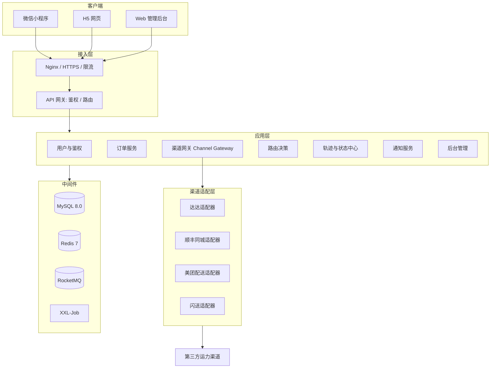
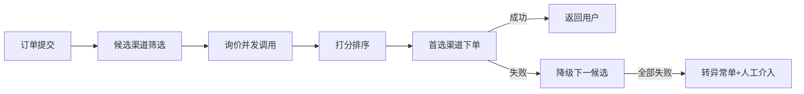
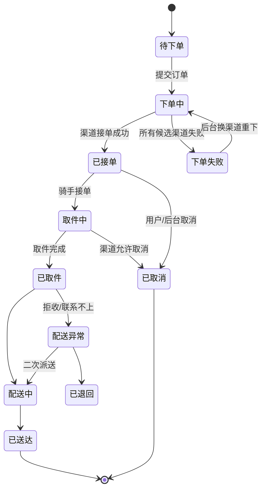
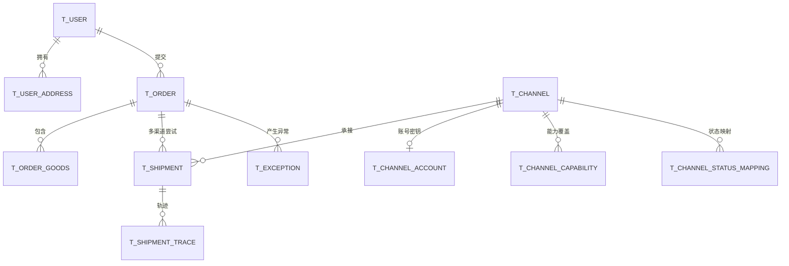

# 聚合配送平台 开发文档

> 形态：微信小程序 + H5（同一套代码多端编译） · Web 管理后台 · 后端服务
> 定位：**多运力渠道聚合配送平台** —— 用户填写地址、电话、物品信息，平台对接第三方运力渠道完成配送

| 项 | 内容 |
| --- | --- |
| 文档版本 | v2.0 |
| 编写日期 | 2026-09-15 |
| 文档状态 | 待评审 |
| 上级版本 | v1.0（已归档至 `docs/archive/`，含运费引擎与支付方案，本期不适用） |

## 修订记录

| 版本 | 日期 | 修订说明 |
| --- | --- | --- |
| v1.0 | 2026-09-14 | 首版：综合快递平台，含自建运费引擎与微信支付 |
| **v2.0** | 2026-09-15 | **范围调整**：去掉运费计费引擎与用户支付；核心转为第三方运力渠道对接；新增渠道接入、渠道路由、轨迹映射、渠道调用治理等章节 |

---

## 1. 项目概述

### 1.1 产品定位

平台**不自建运力和计费体系**，而是作为「中间层」把用户的下单需求聚合后分发给第三方运力渠道（顺丰同城、达达、美团配送、闪送、UU跑腿、蜂鸟即配等），统一收口订单、状态与轨迹。

**平台承担的三件事**：

1. **统一下单入口** —— 用户只填一次地址、电话、物品信息，不必关心由谁配送。
2. **渠道智能路由** —— 按覆盖范围、物品类型、时效、渠道可用性自动选择最优渠道，失败自动换渠道。
3. **状态与轨迹统一** —— 各渠道状态码、轨迹文案、字段命名差异全部收敛为平台标准模型。

### 1.2 明确不做（本期 Out of Scope）

| 不做 | 说明 |
| --- | --- |
| ❌ 自建运费计算引擎 | 费用以渠道返回为准，平台不参与计价 |
| ❌ 用户在线支付 | 无支付环节；若需展示费用，仅作为渠道返回信息的透传展示（可开关） |
| ❌ 自建网点/快递员/车辆/线路管理 | 运力来自第三方，平台不管理实际运力资产 |
| ❌ 电子面单打印 | 由渠道方出具，平台只存单号与截图 |
| ❌ 复杂财务结算 | 平台与渠道的月度对账放二期（P2） |

### 1.3 与 v1.0 的差异对照

| 模块 | v1.0 | v2.0 |
| --- | --- | --- |
| 计费 | 自建运费引擎（首重续重/体积重/分区） | 移除；渠道返回报价，仅透传 |
| 支付 | 微信支付 + 退款 + 流水 | 移除 |
| 运力 | 自建网点、快递员、车辆、线路 | 移除；改为**渠道 + 渠道账号 + 渠道能力** |
| 核心难点 | 运费规则、智能派单 | **渠道适配器、渠道路由、调用治理、状态映射** |
| 订单主键 | 订单 → 运单 | 订单 → 配送单（一次渠道下单尝试 = 一条配送单） |

### 1.4 目标用户

| 角色 | 使用端 | 核心诉求 |
| --- | --- | --- |
| C 端用户 | 小程序 / H5 | 填地址电话物品即下单，实时看配送进度 |
| 收件人 | H5 分享链接 | 无需登录看进度、联系配送员 |
| B 端商户 | 后台 Web 或 OpenAPI（二期） | 批量下单、统一查询、导出 |
| 运营人员 | 后台 Web | 渠道配置、订单监控、异常兜底处理 |
| 管理员 | 后台 Web | 权限、日志、系统参数 |

### 1.5 名词术语

| 术语 | 含义 |
| --- | --- |
| 订单 Order | 用户在平台提交的配送需求（地址、电话、物品） |
| 配送单 Shipment | 一次向某个渠道发起的下单请求及其结果；订单可有多条配送单（换渠道重下） |
| 渠道 Channel | 第三方运力服务商，如达达、顺丰同城 |
| 渠道单号 | 渠道方返回的运单号，面向用户展示 |
| 询价 Quote | 调用渠道预估接口，返回可用性与预估费用 |
| 路由 Route | 为订单挑选渠道的过程 |
| 轨迹映射 | 把渠道状态码/文案转换为平台标准状态 |
| 回调 Callback | 渠道异步推送状态变更到平台 |

---

## 2. 需求分析

### 2.1 用户端功能清单（小程序 + H5）

优先级：**P0** 必须 / **P1** 重要 / **P2** 可延后

| 模块 | 功能点 | 优先级 |
| --- | --- | --- |
| 登录 | 微信授权登录（小程序）、手机号验证码登录（H5） | P0 |
| 登录 | 游客查询（单号 + 手机后 4 位） | P1 |
| 首页 | 「我要配送」主入口 + 「查件」入口 + 当前定位 | P0 |
| 地址 | 寄件人：姓名、电话、地址（定位/地图选点/手动输入） | P0 |
| 地址 | 收件人：姓名、电话、地址（同上） | P0 |
| 地址 | 地址簿：新增、编辑、删除、设默认、一键切换寄收 | P0 |
| 地址 | 地址联想搜索（腾讯地图 suggest + 逆地理编码回填省市区） | P0 |
| 物品 | 物品名称、类型（文件/食品/鲜花/数码/其他）、件数、重量、体积 | P0 |
| 物品 | 违禁品与超规格校验（渠道能力限制前置拦截） | P1 |
| 配送 | 期望送达/取件时间（尽快、指定时间段） | P0 |
| 配送 | 备注、物品图片（选填） | P1 |
| 配送 | 提交下单 → 返回渠道单号与配送员信息 | P0 |
| 配送 | 下单失败自动换渠道重试（用户无感）；全部失败时给出明确提示 | P0 |
| 查询 | 订单列表（进行中 / 已完成 / 已取消） | P0 |
| 查询 | 订单详情：状态 + 时间轴轨迹 + 配送员卡片 | P0 |
| 查询 | 一键拨打配送员电话、催单 | P0 |
| 查询 | 分享给收件人（生成查件链接/小程序路径） | P1 |
| 操作 | 取消订单（取件前可取消；已取件时按渠道规则） | P0 |
| 消息 | 订阅消息推送：已接单、已取件、派送中、已送达 | P0 |
| 我的 | 地址簿、历史订单、客服工单、设置与隐私 | P1 |
| 我的 | 账号注销、数据导出（合规） | P1 |

> **注意**：用户端展示的费用（如有）**一律来自渠道返回**，平台不做二次计算。是否展示由后台「渠道配置 → 展示费用」开关控制。

### 2.2 管理后台功能清单

| 一级模块 | 二级功能 | 优先级 |
| --- | --- | --- |
| 数据看板 | 今日订单量、各渠道占比、成功率、平均接单时长、异常单数 | P0 |
| 渠道管理 | 渠道 CRUD、启停、优先级/权重、超时与重试参数、限流配置 | P0 |
| 渠道账号 | 账号密钥（appKey/appSecret/token）、环境（测试/生产）、关联城市 | P0 |
| 渠道能力 | 覆盖城市、支持物品类型、重量/体积上限、时效区间、是否支持保价/取消 | P0 |
| 渠道探测 | 一键连通性测试、渠道可用性巡检、失败率统计 | P1 |
| 订单管理 | 多条件分页查询、详情、轨迹查看、导出 | P0 |
| 订单干预 | 强制取消、**换渠道重新下单**、手动同步轨迹、人工补录状态 | P0 |
| 配送单管理 | 一个订单下的多渠道下单记录、渠道单号、失败原因 | P0 |
| 调用日志 | 渠道接口请求/响应报文、耗时、错误码（排障核心） | P0 |
| 回调日志 | 渠道回调报文、验签结果、处理状态、手动重放 | P1 |
| 异常中心 | 下单失败、超时未接单、超时未送达、状态长时间未更新 → 生成异常单并流转 | P0 |
| 工单 | 用户投诉/咨询工单、SLA 超时提醒 | P1 |
| 消息中心 | 短信/订阅消息模板、发送记录、失败重试 | P1 |
| 对账 | 渠道账单导入与 Diff（P2） | P2 |
| 系统管理 | 用户、角色、菜单、数据权限、字典、参数、操作日志 | P0 |
| 报表 | 渠道绩效（成功率、时效、投诉率）、城市维度分析 | P1 |

### 2.3 角色权限矩阵（摘要）

| 功能 | 超管 | 运营 | 客服 | 渠道管理员 | 商户 |
| --- | :-: | :-: | :-: | :-: | :-: |
| 订单查看 | ✅全部 | ✅全部 | ✅全部 | ✅全部 | ✅本人 |
| 强制取消/换渠道 | ✅ | ✅ | ✅申请 | ❌ | ❌ |
| 渠道配置与密钥 | ✅ | ❌ | ❌ | ✅ | ❌ |
| 渠道调用日志 | ✅ | ✅查看 | ❌ | ✅ | ❌ |
| 异常单处理 | ✅ | ✅ | ✅ | ✅ | ❌ |
| 系统管理 | ✅ | ❌ | ❌ | ❌ | ❌ |

> 数据权限四档模型：全部 / 本部门 / 本渠道 / 仅本人（见 8.4）。

---

## 3. 总体架构

### 3.1 架构分层



**关键点**：所有渠道调用必须经由**渠道网关 + 适配层**，业务代码不得直接调用任何渠道 HTTP 接口。这是本项目的核心架构约束。

### 3.2 技术选型

| 层 | 选型 | 说明 |
| --- | --- | --- |
| 小程序/H5 | Taro 4 + React 18 + TypeScript | 一套代码编译小程序与 H5；备选 uni-app |
| 小程序 UI | Taroify / NutUI-Taro | 移动端组件 |
| 状态管理 | Zustand | 轻量 TS 友好 |
| 后台前端 | Vue 3 + TypeScript + Vite 5 + Element Plus + Pinia + ECharts | 表格/表单能力强 |
| 后端 | Java 17 + Spring Boot 3.2 | 适配器模式、SPI 生态成熟 |
| 数据访问 | MyBatis-Plus | 单表快、复杂 SQL 可控 |
| 数据库 | MySQL 8.0（utf8mb4 / InnoDB） | 主从 + 读写分离（P1） |
| 缓存 | Redis 7 | 渠道配置缓存、幂等锁、限流、GEO |
| 消息队列 | RocketMQ 5 | 异步下单、延迟重试、超时巡检、催单 |
| 定时任务 | XXL-Job | 轨迹同步、渠道巡检、异常巡检 |
| 熔断限流 | Sentinel 或 Resilience4j | 单渠道熔断，避免拖垮整体 |
| HTTP 客户端 | OkHttp / WebClient + 连接池 | 每个渠道独立连接池与超时 |
| 权限 | Sa-Token | 轻量 |
| 接口文档 | Knife4j / springdoc-openapi | 在线调试 |
| 地图 | 腾讯位置服务 | 地址联想、选点、逆地理编码 |
| 部署 | Docker Compose → K8s | 渐进演进 |

### 3.3 工程结构

```
delivery-platform
├── dp-common            公共：统一响应、异常、工具、枚举、状态映射字典
├── dp-api               对外 API（Controller + DTO）
├── dp-service           业务逻辑（订单、路由、轨迹、通知）
├── dp-channel           渠道接入层 ★ 核心
│   ├── dp-channel-core        SPI 接口、注册中心、通用模型
│   ├── dp-channel-dada        达达适配器
│   ├── dp-channel-sf          顺丰同城适配器
│   ├── dp-channel-meituan     美团配送适配器
│   ├── dp-channel-shansong    闪送适配器
│   └── dp-channel-http        通用 HTTP 客户端、签名、重试、日志切面
├── dp-dao               数据访问
├── dp-job               定时任务
├── dp-admin             后台管理模块
└── dp-boot              启动与配置
```

---

## 4. 渠道接入设计（核心章节）

### 4.1 统一适配器 SPI

```java
public interface DeliveryChannelAdapter {

    /** 渠道唯一标识，如 DADA / SF_SAME_CITY / MEITUAN */
    String channelCode();

    /** 是否支持该配送场景（城市 + 物品类型 + 重量体积 + 时效） */
    boolean supports(CapabilityContext ctx);

    /** 询价 / 预下单：返回可用性、预估费用、预估送达时间 */
    QuoteResult quote(QuoteRequest request);

    /** 正式下单：返回渠道单号、配送员信息 */
    CreateResult createOrder(CreateOrderRequest request);

    /** 取消订单 */
    CancelResult cancel(CancelRequest request);

    /** 查询订单详情 */
    QueryResult queryOrder(String channelOrderNo);

    /** 查询轨迹 */
    TrackResult queryTrack(String channelOrderNo);

    /** 催单 */
    default UrgeResult urge(String channelOrderNo) {
        return UrgeResult.unsupported();
    }

    /** 解析异步回调，转换为统一事件 */
    CallbackEvent parseCallback(String rawBody, Map<String, String> headers);
}
```

**设计要点**

- 每个渠道一个 Spring `@Component`，通过 `channelCode()` 自注册进 `ChannelRegistry`，新增渠道不改动主流程代码。
- 适配器内部负责：签名、报文组装、字段映射、错误码翻译、时间格式转换。**对外只暴露平台标准模型**。
- 平台标准模型（`dp-channel-core`）与渠道私有报文完全隔离，渠道文档变更只影响对应适配器。

```java
@Component
public class DadaChannelAdapter implements DeliveryChannelAdapter {
    public String channelCode() { return "DADA"; }
    public boolean supports(CapabilityContext ctx) { ... }
    public CreateResult createOrder(CreateOrderRequest req) { ... }
    // 内部：DadaSignUtils.sign() / DadaStatusMapper.toPlatform()
}
```

### 4.2 渠道路由决策

路由在 `dp-service` 的路由决策器中完成，流程：



**第一步：候选筛选（前置硬过滤）**

```
候选 = 渠道状态=启用
     AND 覆盖城市包含收件城市
     AND 支持该物品类型
     AND 重量/体积在限制内
     AND 支持所需增值能力（如需取消、需保价）
     AND 渠道熔断器状态=可用
     AND 账号 token 有效
```

**第二步：打分排序**

```
score = 0.30 × 渠道权重(后台可配)
      + 0.25 × 历史成功率(近 24h 滑动窗口)
      + 0.20 × 时效得分(预估送达越早越高)
      + 0.15 × 价格得分(预估费用越低越高，可选择关闭)
      + 0.10 × 用户偏好命中(商户指定渠道则直接置顶)
```

**第三步：下单与降级**

- 首选渠道下单失败（渠道侧错误码可重试类）→ 立即尝试次选渠道，最多重试 N 个渠道（默认 3）。
- 用户侧只看到一个结果，中间过程记录在 `t_shipment`（每个渠道一条尝试记录）。
- 全部失败 → 订单置为「下单失败」，生成异常单并推送运营。

**兜底策略**

| 场景 | 处理 |
| --- | --- |
| 询价全部超时 | 跳过询价，按后台预设渠道优先级直连下单 |
| 首选渠道限流 | 熔断 30s，直接走次选 |
| 渠道返回「暂无骑手」 | 视为可重试，30s 后重试，最多 3 次，再降级换渠道 |
| 渠道账号 token 失效 | 自动刷新 token；刷新失败则跳过该渠道并告警 |

### 4.3 渠道调用治理

| 能力 | 实现 |
| --- | --- |
| 超时 | 每渠道独立配置（默认连接 3s / 读 8s），下单接口读超时放宽到 15s |
| 重试 | 仅对「网络异常 / 5xx / 渠道限流」重试；下单接口重试前先调查询接口确认是否已创建，避免重复下单 |
| 幂等 | 平台订单号作为渠道侧 `partner_order_no` 传入；重复请求时渠道返回同一单号即视为成功 |
| 熔断 | Sentinel 按 `channelCode` 资源隔离，滑动窗口失败率 > 50% 且样本 ≥ 20 时熔断 30s |
| 限流 | 各渠道 QPS 上限可配（如达达 20 QPS），超出排队等待，等待超阈值直接降级 |
| 连接池 | 每渠道独立连接池，避免单个渠道慢请求占满全局线程 |
| 日志 | 通过 AOP 统一记录 `t_channel_request_log`（请求/响应/耗时/错误码），敏感字段（手机号）脱敏后落库 |
| 告警 | 单渠道连续失败 ≥ 10 次、或成功率 5 分钟低于 80% → 企业微信/短信告警 |

### 4.4 状态与轨迹映射

各渠道状态码、文案不统一，必须建立映射字典。

**平台标准状态**

| 平台状态 | 值 | 说明 |
| --- | --- | --- |
| PENDING | 0 | 待下单 |
| DISPATCHING | 5 | 下单中（调用渠道中） |
| ACCEPTED | 10 | 渠道已接单 |
| PICKING | 20 | 骑手已接单前往取件 |
| PICKED_UP | 30 | 已取件 |
| DELIVERING | 40 | 配送中 |
| DELIVERED | 50 | 已送达 |
| CANCELLED | 60 | 已取消 |
| FAILED | 70 | 下单失败 / 配送异常 |

**映射字典表结构**（`t_channel_status_mapping`）

| 字段 | 说明 |
| --- | --- |
| channel_code | 渠道标识 |
| channel_status | 渠道原始状态码 |
| platform_status | 平台标准状态 |
| trace_desc_template | 对外文案模板，如 `骑手{name}已取件` |
| sort | 展示排序 |

- 映射关系**持久化在数据库并缓存到 Redis**，新增渠道或渠道改版时后台可直接维护，无需发版。
- 未命中映射时：记录告警日志，按「不推进状态」处理，避免误把订单推到终态。

### 4.5 回调处理

- 统一入口：`POST /api/v1/callback/{channelCode}`
- 处理链路：**验签 → 原文落库（t_channel_callback_log）→ 转换为统一事件 → 更新配送单与订单状态 → 写轨迹 → 发 MQ 触发用户通知**
- 必须幂等：以 `渠道 + 渠道单号 + 渠道事件 ID` 做唯一键，重复回调直接返回成功。
- 必须**快速响应**：验签后立即返回 `success`，业务处理异步化，避免渠道因超时重推导致风暴。
- 兜底：回调丢失时由 XXL-Job 定时主动轮询轨迹补偿（每 5 分钟扫进行中订单）。

### 4.6 新增渠道的标准作业流程（SOP）

1. 在 `dp-channel-xxx` 模块内实现 `DeliveryChannelAdapter`。
2. 补充该渠道的状态映射字典（SQL 脚本 + 后台配置）。
3. 在后台「渠道管理」中创建渠道、配置账号密钥、能力覆盖城市、超时/重试/限流参数。
4. 用「连通性测试」按钮验证 token 与网络。
5. 沙箱环境跑通：询价 → 下单 → 查轨迹 → 取消 全链路。
6. 灰度：`weight` 设低，仅指定城市或指定用户命中，观察成功率后再放量。

> **目标**：新增一个渠道的开发工作量控制在 **1.5 人日以内**。

---

## 5. 业务状态机

### 5.1 订单状态流转



### 5.2 状态流转约束

- 状态**只允许单向前进**，禁止回退（`配送异常 → 配送中` 为唯一例外）。
- 所有状态变更必须经 `OrderStateMachine` 校验，非法流转直接抛业务异常并记录告警。
- 每次流转写入 `t_shipment_trace`，并产生一条面向用户的轨迹。
- 终态（已送达/已取消/已退回）禁止任何后续变更。

---

## 6. 数据库设计

### 6.1 设计规范

- `InnoDB` + `utf8mb4`；统一 `id/create_time/update_time/deleted` 字段。
- 手机号加密存储（AES-256-GCM）+ `phone_hash` 用于查询；展示脱敏。
- 金额字段（渠道返回的费用）用 `DECIMAL(12,2)`。
- `t_channel_request_log` 写入量最大，**按月分表**并设置 90 天归档策略。
- 所有"渠道侧"字段统一加 `channel_` 前缀，避免与平台字段混淆。

### 6.2 核心 ER 关系



### 6.3 渠道相关表

```sql
-- 渠道
CREATE TABLE `t_channel` (
  `id`            BIGINT UNSIGNED NOT NULL AUTO_INCREMENT,
  `channel_code`  VARCHAR(32)  NOT NULL COMMENT '渠道标识:DADA/SF_SAME_CITY/MEITUAN',
  `channel_name`  VARCHAR(64)  NOT NULL COMMENT '渠道名称',
  `channel_type`  TINYINT      NOT NULL DEFAULT 1 COMMENT '1即时配送 2同城货运 3快递',
  `logo_url`      VARCHAR(512) DEFAULT NULL,
  `api_base_url`  VARCHAR(255) NOT NULL COMMENT '生产环境接口地址',
  `sandbox_url`   VARCHAR(255) DEFAULT NULL COMMENT '沙箱地址',
  `priority`      INT          NOT NULL DEFAULT 100 COMMENT '优先级,越小越优先',
  `weight`        DECIMAL(5,2) NOT NULL DEFAULT 1.00 COMMENT '路由打分权重',
  `score_enabled` TINYINT      NOT NULL DEFAULT 0 COMMENT '是否启用打分路由',
  `timeout_ms`    INT          NOT NULL DEFAULT 8000 COMMENT '读超时',
  `retry_times`   INT          NOT NULL DEFAULT 1 COMMENT '重试次数',
  `rate_limit_qps` INT         NOT NULL DEFAULT 20 COMMENT 'QPS上限',
  `show_fee`      TINYINT      NOT NULL DEFAULT 1 COMMENT '是否向用户展示费用',
  `status`        TINYINT      NOT NULL DEFAULT 1 COMMENT '1启用 0停用',
  `remark`        VARCHAR(255) DEFAULT NULL,
  `create_time`   DATETIME     NOT NULL DEFAULT CURRENT_TIMESTAMP,
  `update_time`   DATETIME     NOT NULL DEFAULT CURRENT_TIMESTAMP ON UPDATE CURRENT_TIMESTAMP,
  `deleted`       TINYINT      NOT NULL DEFAULT 0,
  PRIMARY KEY (`id`),
  UNIQUE KEY `uk_channel_code` (`channel_code`),
  KEY `idx_status_priority` (`status`,`priority`)
) ENGINE=InnoDB DEFAULT CHARSET=utf8mb4 COMMENT='运力渠道';

-- 渠道账号与密钥
CREATE TABLE `t_channel_account` (
  `id`               BIGINT UNSIGNED NOT NULL AUTO_INCREMENT,
  `channel_id`       BIGINT UNSIGNED NOT NULL,
  `account_name`     VARCHAR(64)  NOT NULL COMMENT '账号名称',
  `app_key`          VARCHAR(128) NOT NULL,
  `app_secret`       VARBINARY(512) NOT NULL COMMENT 'AES加密存储',
  `access_token`     VARCHAR(512) DEFAULT NULL,
  `refresh_token`    VARCHAR(512) DEFAULT NULL,
  `token_expire_time` DATETIME   DEFAULT NULL,
  `source_id`        VARCHAR(64)  DEFAULT NULL COMMENT '渠道侧门店/商户ID',
  `env`              TINYINT      NOT NULL DEFAULT 2 COMMENT '1沙箱 2生产',
  `status`           TINYINT      NOT NULL DEFAULT 1,
  `create_time`      DATETIME     NOT NULL DEFAULT CURRENT_TIMESTAMP,
  `update_time`      DATETIME     NOT NULL DEFAULT CURRENT_TIMESTAMP ON UPDATE CURRENT_TIMESTAMP,
  `deleted`          TINYINT      NOT NULL DEFAULT 0,
  PRIMARY KEY (`id`),
  KEY `idx_channel_env` (`channel_id`,`env`,`status`)
) ENGINE=InnoDB DEFAULT CHARSET=utf8mb4 COMMENT='渠道账号密钥';

-- 渠道能力覆盖（路由筛选依据）
CREATE TABLE `t_channel_capability` (
  `id`            BIGINT UNSIGNED NOT NULL AUTO_INCREMENT,
  `channel_id`    BIGINT UNSIGNED NOT NULL,
  `city_code`     VARCHAR(16)  NOT NULL COMMENT '城市编码',
  `city_name`     VARCHAR(32)  NOT NULL,
  `goods_type`    VARCHAR(32)  NOT NULL DEFAULT 'ALL' COMMENT '物品类型,ALL为不限',
  `product_code`  VARCHAR(32)  DEFAULT NULL COMMENT '渠道产品编码',
  `min_weight`    DECIMAL(10,3) NOT NULL DEFAULT 0,
  `max_weight`    DECIMAL(10,3) NOT NULL DEFAULT 100,
  `max_length`    INT          DEFAULT NULL COMMENT 'cm',
  `aging_min_min` INT          DEFAULT NULL COMMENT '最快送达分钟',
  `aging_max_min` INT          DEFAULT NULL COMMENT '最慢送达分钟',
  `support_cancel` TINYINT     NOT NULL DEFAULT 1 COMMENT '是否支持取消',
  `support_insured` TINYINT    NOT NULL DEFAULT 0,
  `support_cod`   TINYINT      NOT NULL DEFAULT 0,
  `status`        TINYINT      NOT NULL DEFAULT 1,
  `create_time`   DATETIME     NOT NULL DEFAULT CURRENT_TIMESTAMP,
  PRIMARY KEY (`id`),
  KEY `idx_city_goods` (`city_code`,`goods_type`,`status`)
) ENGINE=InnoDB DEFAULT CHARSET=utf8mb4 COMMENT='渠道能力覆盖';

-- 渠道状态映射字典
CREATE TABLE `t_channel_status_mapping` (
  `id`            BIGINT UNSIGNED NOT NULL AUTO_INCREMENT,
  `channel_id`    BIGINT UNSIGNED NOT NULL,
  `channel_status` VARCHAR(32) NOT NULL COMMENT '渠道原始状态码',
  `platform_status` TINYINT    NOT NULL COMMENT '平台标准状态',
  `trace_desc_template` VARCHAR(255) DEFAULT NULL COMMENT '轨迹文案模板',
  `sort`          INT          NOT NULL DEFAULT 0,
  `create_time`   DATETIME     NOT NULL DEFAULT CURRENT_TIMESTAMP,
  PRIMARY KEY (`id`),
  UNIQUE KEY `uk_channel_status` (`channel_id`,`channel_status`)
) ENGINE=InnoDB DEFAULT CHARSET=utf8mb4 COMMENT='渠道状态映射';

-- 渠道接口调用日志（按月分表,量大）
CREATE TABLE `t_channel_request_log` (
  `id`           BIGINT UNSIGNED NOT NULL AUTO_INCREMENT,
  `channel_code` VARCHAR(32)  NOT NULL,
  `biz_type`     VARCHAR(16)  NOT NULL COMMENT 'QUOTE/CREATE/CANCEL/QUERY/TRACK/URGE/TOKEN',
  `biz_no`       VARCHAR(32)  DEFAULT NULL COMMENT '平台订单号/配送单号',
  `request_url`  VARCHAR(512) DEFAULT NULL,
  `request_body` TEXT         DEFAULT NULL COMMENT '脱敏后报文',
  `response_body` TEXT        DEFAULT NULL,
  `http_status`  INT          DEFAULT NULL,
  `success`      TINYINT      NOT NULL DEFAULT 1,
  `error_code`   VARCHAR(64)  DEFAULT NULL COMMENT '渠道错误码',
  `error_msg`    VARCHAR(500) DEFAULT NULL,
  `retry_index`  INT          NOT NULL DEFAULT 0,
  `cost_ms`      INT          DEFAULT NULL,
  `create_time`  DATETIME     NOT NULL DEFAULT CURRENT_TIMESTAMP,
  PRIMARY KEY (`id`),
  KEY `idx_channel_time` (`channel_code`,`create_time`),
  KEY `idx_biz_no` (`biz_no`)
) ENGINE=InnoDB DEFAULT CHARSET=utf8mb4 COMMENT='渠道调用日志';

-- 渠道回调日志
CREATE TABLE `t_channel_callback_log` (
  `id`            BIGINT UNSIGNED NOT NULL AUTO_INCREMENT,
  `channel_code`  VARCHAR(32)  NOT NULL,
  `event_id`      VARCHAR(64)  DEFAULT NULL COMMENT '渠道事件ID,用于幂等',
  `raw_body`      TEXT         NOT NULL,
  `sign_valid`    TINYINT      NOT NULL DEFAULT 1,
  `biz_no`        VARCHAR(32)  DEFAULT NULL,
  `handle_status` TINYINT      NOT NULL DEFAULT 0 COMMENT '0待处理 1成功 2失败',
  `retry_count`   INT          NOT NULL DEFAULT 0,
  `error_msg`     VARCHAR(500) DEFAULT NULL,
  `create_time`   DATETIME     NOT NULL DEFAULT CURRENT_TIMESTAMP,
  PRIMARY KEY (`id`),
  UNIQUE KEY `uk_event` (`channel_code`,`event_id`),
  KEY `idx_handle_status` (`handle_status`,`create_time`)
) ENGINE=InnoDB DEFAULT CHARSET=utf8mb4 COMMENT='渠道回调日志';
```

### 6.4 订单与配送相关表

```sql
-- 配送订单
CREATE TABLE `t_order` (
  `id`             BIGINT UNSIGNED NOT NULL AUTO_INCREMENT,
  `order_no`       VARCHAR(32)  NOT NULL COMMENT '平台订单号',
  `user_id`        BIGINT UNSIGNED NOT NULL,
  `status`         TINYINT      NOT NULL DEFAULT 0 COMMENT '见平台标准状态',
  `biz_type`       TINYINT      NOT NULL DEFAULT 1 COMMENT '1个人 2商户',
  `sender_name`    VARCHAR(64)  NOT NULL,
  `sender_phone`   VARBINARY(128) NOT NULL COMMENT 'AES加密',
  `sender_phone_hash` CHAR(64)  NOT NULL,
  `sender_province` VARCHAR(32) NOT NULL,
  `sender_city`    VARCHAR(32)  NOT NULL,
  `sender_district` VARCHAR(32) NOT NULL,
  `sender_address` VARCHAR(255) NOT NULL,
  `sender_lng`     DECIMAL(10,6) DEFAULT NULL,
  `sender_lat`     DECIMAL(10,6) DEFAULT NULL,
  `receiver_name`  VARCHAR(64)  NOT NULL,
  `receiver_phone` VARBINARY(128) NOT NULL,
  `receiver_phone_hash` CHAR(64) NOT NULL,
  `receiver_province` VARCHAR(32) NOT NULL,
  `receiver_city`  VARCHAR(32)  NOT NULL,
  `receiver_district` VARCHAR(32) NOT NULL,
  `receiver_address` VARCHAR(255) NOT NULL,
  `receiver_lng`   DECIMAL(10,6) DEFAULT NULL,
  `receiver_lat`   DECIMAL(10,6) DEFAULT NULL,
  `goods_type`     VARCHAR(32)  NOT NULL DEFAULT 'OTHER' COMMENT '物品类型',
  `goods_count`    INT          NOT NULL DEFAULT 1 COMMENT '件数',
  `goods_weight`   DECIMAL(10,3) DEFAULT NULL COMMENT 'kg',
  `goods_length`   INT          DEFAULT NULL COMMENT 'cm',
  `goods_width`    INT          DEFAULT NULL,
  `goods_height`   INT          DEFAULT NULL,
  `goods_images`   VARCHAR(1024) DEFAULT NULL COMMENT '物品图片,逗号分隔',
  `expect_type`    TINYINT      NOT NULL DEFAULT 1 COMMENT '1尽快 2指定时间',
  `expect_start`   DATETIME     DEFAULT NULL,
  `expect_end`     DATETIME     DEFAULT NULL,
  `insured_amount` DECIMAL(12,2) DEFAULT NULL COMMENT '保价金额',
  `remark`         VARCHAR(255) DEFAULT NULL,
  `active_shipment_id` BIGINT UNSIGNED DEFAULT NULL COMMENT '当前生效配送单',
  `channel_order_no` VARCHAR(64) DEFAULT NULL COMMENT '冗余:当前渠道单号,便于查件',
  `channel_code`   VARCHAR(32)  DEFAULT NULL COMMENT '冗余:当前渠道',
  `finish_time`    DATETIME     DEFAULT NULL,
  `cancel_reason`  VARCHAR(255) DEFAULT NULL,
  `create_time`    DATETIME     NOT NULL DEFAULT CURRENT_TIMESTAMP,
  `update_time`    DATETIME     NOT NULL DEFAULT CURRENT_TIMESTAMP ON UPDATE CURRENT_TIMESTAMP,
  `deleted`        TINYINT      NOT NULL DEFAULT 0,
  PRIMARY KEY (`id`),
  UNIQUE KEY `uk_order_no` (`order_no`),
  UNIQUE KEY `uk_channel_order_no` (`channel_code`,`channel_order_no`),
  KEY `idx_user_status` (`user_id`,`status`,`create_time`),
  KEY `idx_status_create` (`status`,`create_time`),
  KEY `idx_receiver_phone` (`receiver_phone_hash`),
  KEY `idx_sender_phone` (`sender_phone_hash`)
) ENGINE=InnoDB DEFAULT CHARSET=utf8mb4 COMMENT='配送订单';

-- 配送单（一次渠道下单尝试）
CREATE TABLE `t_shipment` (
  `id`               BIGINT UNSIGNED NOT NULL AUTO_INCREMENT,
  `shipment_no`      VARCHAR(32)  NOT NULL COMMENT '平台配送单号',
  `order_id`         BIGINT UNSIGNED NOT NULL,
  `order_no`         VARCHAR(32)  NOT NULL,
  `channel_id`       BIGINT UNSIGNED NOT NULL,
  `channel_code`     VARCHAR(32)  NOT NULL,
  `channel_order_no` VARCHAR(64)  DEFAULT NULL COMMENT '渠道单号',
  `status`           TINYINT      NOT NULL DEFAULT 0 COMMENT '平台标准状态',
  `channel_status`   VARCHAR(32)  DEFAULT NULL COMMENT '渠道原始状态',
  `dispatch_attempt` INT          NOT NULL DEFAULT 1 COMMENT '第几次下单尝试',
  `route_score`      DECIMAL(6,2) DEFAULT NULL COMMENT '路由打分',
  `route_reason`     VARCHAR(255) DEFAULT NULL COMMENT '选择该渠道的原因',
  `fee_amount`       DECIMAL(12,2) DEFAULT NULL COMMENT '渠道返回费用',
  `fee_detail`       VARCHAR(512) DEFAULT NULL COMMENT '费用明细JSON',
  `rider_name`       VARCHAR(64)  DEFAULT NULL,
  `rider_phone`      VARCHAR(64)  DEFAULT NULL COMMENT '虚拟号/加密',
  `rider_lng`        DECIMAL(10,6) DEFAULT NULL,
  `rider_lat`        DECIMAL(10,6) DEFAULT NULL,
  `estimate_arrive`  DATETIME     DEFAULT NULL COMMENT '预估送达',
  `accept_time`      DATETIME     DEFAULT NULL COMMENT '渠道接单时间',
  `pickup_time`      DATETIME     DEFAULT NULL,
  `deliver_time`     DATETIME     DEFAULT NULL COMMENT '送达时间',
  `cancel_time`      DATETIME     DEFAULT NULL,
  `fail_reason`      VARCHAR(500) DEFAULT NULL,
  `last_sync_time`   DATETIME     DEFAULT NULL COMMENT '最后一次同步轨迹时间',
  `create_time`      DATETIME     NOT NULL DEFAULT CURRENT_TIMESTAMP,
  `update_time`      DATETIME     NOT NULL DEFAULT CURRENT_TIMESTAMP ON UPDATE CURRENT_TIMESTAMP,
  PRIMARY KEY (`id`),
  UNIQUE KEY `uk_shipment_no` (`shipment_no`),
  KEY `idx_order` (`order_id`),
  KEY `idx_channel_order` (`channel_code`,`channel_order_no`),
  KEY `idx_status_sync` (`status`,`last_sync_time`)
) ENGINE=InnoDB DEFAULT CHARSET=utf8mb4 COMMENT='配送单(渠道下单记录)';

-- 统一轨迹
CREATE TABLE `t_shipment_trace` (
  `id`              BIGINT UNSIGNED NOT NULL AUTO_INCREMENT,
  `shipment_id`     BIGINT UNSIGNED NOT NULL,
  `order_no`        VARCHAR(32)  NOT NULL,
  `channel_code`    VARCHAR(32)  NOT NULL,
  `platform_status` TINYINT      NOT NULL,
  `channel_status`  VARCHAR(32)  DEFAULT NULL,
  `trace_desc`      VARCHAR(255) NOT NULL COMMENT '对用户展示的文案',
  `operator_name`   VARCHAR(64)  DEFAULT NULL,
  `operator_phone`  VARCHAR(64)  DEFAULT NULL,
  `lng`             DECIMAL(10,6) DEFAULT NULL,
  `lat`             DECIMAL(10,6) DEFAULT NULL,
  `trace_time`      DATETIME     NOT NULL COMMENT '渠道侧发生时间',
  `source`          TINYINT      NOT NULL DEFAULT 1 COMMENT '1回调 2轮询 3后台补录',
  `create_time`     DATETIME     NOT NULL DEFAULT CURRENT_TIMESTAMP,
  PRIMARY KEY (`id`),
  KEY `idx_order_time` (`order_no`,`trace_time`),
  KEY `idx_shipment` (`shipment_id`,`trace_time`)
) ENGINE=InnoDB DEFAULT CHARSET=utf8mb4 COMMENT='统一配送轨迹';

-- 异常单
CREATE TABLE `t_exception` (
  `id`           BIGINT UNSIGNED NOT NULL AUTO_INCREMENT,
  `exception_no` VARCHAR(32)  NOT NULL,
  `order_no`     VARCHAR(32)  DEFAULT NULL,
  `type`         TINYINT      NOT NULL COMMENT '1下单失败 2超时未接单 3超时未送达 4轨迹停滞 5渠道取消 6其他',
  `level`        TINYINT      NOT NULL DEFAULT 2 COMMENT '1紧急 2高 3普通',
  `content`      VARCHAR(500) NOT NULL,
  `channel_code` VARCHAR(32)  DEFAULT NULL,
  `status`       TINYINT      NOT NULL DEFAULT 0 COMMENT '0待处理 1处理中 2已解决 3已忽略',
  `handler_id`   BIGINT UNSIGNED DEFAULT NULL,
  `handle_result` VARCHAR(500) DEFAULT NULL,
  `sla_time`     DATETIME     DEFAULT NULL,
  `create_time`  DATETIME     NOT NULL DEFAULT CURRENT_TIMESTAMP,
  `update_time`  DATETIME     NOT NULL DEFAULT CURRENT_TIMESTAMP ON UPDATE CURRENT_TIMESTAMP,
  PRIMARY KEY (`id`),
  UNIQUE KEY `uk_exception_no` (`exception_no`),
  KEY `idx_status_sla` (`status`,`sla_time`),
  KEY `idx_order` (`order_no`)
) ENGINE=InnoDB DEFAULT CHARSET=utf8mb4 COMMENT='异常单';
```

### 6.5 其他表清单

| 表名 | 说明 |
| --- | --- |
| `t_user` | 用户（openid、昵称、加密手机号、类型） |
| `t_user_address` | 地址簿（寄件/收件通用，`type` 区分） |
| `t_order_goods` | 物品明细（多物品时） |
| `t_channel_health` | 渠道健康度小时快照（成功率、P95 耗时、接单率） |
| `t_complaint` | 用户工单（咨询/投诉/理赔） |
| `t_message_template` / `t_message_record` | 消息模板与发送记录 |
| `t_open_api_app` | 商户 OpenAPI 应用（二期） |
| `t_sys_user` / `t_sys_role` / `t_sys_menu` / `t_sys_user_role` / `t_sys_role_menu` | 后台权限体系 |
| `t_dict_type` / `t_dict_data` | 数据字典（物品类型、城市等） |
| `t_config` | 系统参数 |
| `t_operation_log` | 后台操作日志 |

---

## 7. 接口设计

### 7.1 通用规范

**Base URL**：`https://api.xxx.com/api/v1`（用户端）· `https://api.xxx.com/admin/v1`（后台）· `https://api.xxx.com/api/v1/callback`（渠道回调）

**统一响应体**

```json
{ "code": 0, "message": "success", "data": {}, "traceId": "a1b2c3d4e5f6" }
```

| code | 含义 |
| --- | --- |
| 0 | 成功 |
| 400 | 参数校验失败 |
| 401 / 403 | 未登录 / 无权限 |
| 409 | 业务冲突（重复提交、状态不允许） |
| 429 | 请求过于频繁 |
| 500 | 服务端异常 |
| 2001 | 订单不存在 |
| 2002 | 该订单状态不可取消 |
| 3001 | 无可用渠道（覆盖范围内无运力） |
| 3002 | 所有候选渠道下单失败 |
| 3003 | 物品超出渠道承运范围 |

**幂等**：下单接口必须携带 `idempotentToken`（客户端 UUID）；服务端用 Redis `SETNX`（TTL 10 分钟）保证同一 token 只创建一次订单。

### 7.2 用户端接口清单

| # | 方法 | 路径 | 说明 | 鉴权 |
| --- | --- | --- | --- | --- |
| 1 | POST | `/auth/wx-login` | 微信 code 换 token | 否 |
| 2 | POST | `/auth/sms-code` | 发送短信验证码 | 否 |
| 3 | POST | `/auth/sms-login` | 验证码登录 | 否 |
| 4 | GET | `/user/profile` | 用户信息 | 是 |
| 5 | POST | `/user/logout` | 退出登录 | 是 |
| 6 | POST | `/user/cancel-account` | 注销账号 | 是 |
| 7 | GET | `/addresses` | 地址列表 | 是 |
| 8 | POST | `/addresses` | 新增地址 | 是 |
| 9 | PUT | `/addresses/{id}` | 编辑地址 | 是 |
| 10 | DELETE | `/addresses/{id}` | 删除地址 | 是 |
| 11 | GET | `/addresses/default` | 默认地址 | 是 |
| 12 | GET | `/map/suggest` | 地址联想（腾讯地图代理） | 是 |
| 13 | POST | `/map/geocode` | 逆地理编码（坐标→地址） | 是 |
| 14 | GET | `/map/distance` | 计算寄收距离 | 是 |
| 15 | GET | `/dict/goods-types` | 物品类型字典 | 否 |
| 16 | POST | `/delivery/check` | **下单前校验**：是否可达、是否超规格 | 是 |
| 17 | POST | `/delivery/quote` | 询价（可选，返回可用渠道与预估费用） | 是 |
| 18 | POST | `/orders` | **提交配送订单** | 是 |
| 19 | GET | `/orders` | 订单列表（按状态筛选） | 是 |
| 20 | GET | `/orders/{orderNo}` | 订单详情 | 是 |
| 21 | GET | `/orders/{orderNo}/traces` | 统一轨迹 | 是 |
| 22 | GET | `/orders/{orderNo}/rider` | 配送员信息 | 是 |
| 23 | POST | `/orders/{orderNo}/cancel` | 取消订单 | 是 |
| 24 | POST | `/orders/{orderNo}/urge` | 催单 | 是 |
| 25 | POST | `/orders/query` | 游客查件（单号+手机后4位） | 否 |
| 26 | POST | `/complaints` | 提交工单 | 是 |
| 27 | GET | `/message/list` | 消息列表 | 是 |

### 7.3 后台接口清单（摘要）

| 模块 | 接口 |
| --- | --- |
| 登录 | `POST /admin/auth/login`、`POST /admin/auth/logout`、`GET /admin/auth/userinfo`、`GET /admin/auth/routers` |
| 渠道 | `GET/POST/PUT/DELETE /admin/channels`、`PUT /admin/channels/{id}/status`、`POST /admin/channels/{id}/test`（连通性测试） |
| 渠道账号 | `GET/PUT /admin/channels/{id}/account`、`POST /admin/channels/{id}/account/refresh-token` |
| 渠道能力 | `GET/POST/PUT/DELETE /admin/channels/{id}/capabilities`、`POST /admin/channels/{id}/capabilities/import`（Excel 批量导入） |
| 状态映射 | `GET/POST/PUT /admin/channels/{id}/status-mappings` |
| 订单 | `GET /admin/orders`、`GET /admin/orders/{no}`、`POST /admin/orders/{no}/cancel`、`POST /admin/orders/{no}/redispatch`（换渠道重下）、`POST /admin/orders/{no}/sync-trace`、`POST /admin/orders/{no}/trace`（人工补录）、`GET /admin/orders/export` |
| 配送单 | `GET /admin/shipments`、`GET /admin/shipments/{no}` |
| 调用日志 | `GET /admin/channel-logs`、`GET /admin/channel-logs/{id}`、`GET /admin/channel-stats` |
| 回调日志 | `GET /admin/callback-logs`、`POST /admin/callback-logs/{id}/replay`（手动重放） |
| 异常单 | `GET /admin/exceptions`、`PUT /admin/exceptions/{id}/handle`、`PUT /admin/exceptions/{id}/ignore` |
| 看板 | `GET /admin/dashboard/overview`、`GET /admin/dashboard/channel-rank`、`GET /admin/dashboard/trend`、`GET /admin/dashboard/exception` |
| 工单 | `GET /admin/complaints`、`PUT /admin/complaints/{id}/handle` |
| 系统 | 用户/角色/菜单/字典/参数/日志 标准 CRUD |

### 7.4 关键接口示例

**下单前校验**

```
POST /api/v1/delivery/check
{
  "senderCity": "北京市", "senderDistrict": "朝阳区",
  "receiverCity": "北京市", "receiverDistrict": "海淀区",
  "goodsType": "FILE", "goodsWeight": 2.5, "goodsCount": 1
}
```

```json
{
  "code": 0,
  "data": {
    "deliverable": true,
    "availableChannels": 3,
    "estimatedArrive": "2026-09-15 11:30",
    "warnings": []
  }
}
```

**提交订单**

```json
POST /api/v1/orders
{
  "idempotentToken": "uuid-xxxx-xxxx",
  "sender": {
    "name": "张三", "phone": "13800000000",
    "province": "北京市", "city": "北京市", "district": "朝阳区",
    "address": "望京SOHO T1 20层", "lng": 116.480, "lat": 39.996
  },
  "receiver": {
    "name": "李四", "phone": "13900000000",
    "province": "北京市", "city": "北京市", "district": "海淀区",
    "address": "中关村大街 1 号", "lng": 116.31, "lat": 39.98
  },
  "goods": {
    "type": "FILE", "count": 1, "weight": 2.5,
    "length": 30, "width": 20, "height": 10,
    "images": ["https://oss.xxx.com/a.jpg"]
  },
  "expectType": 1,
  "insuredAmount": 0,
  "remark": "请提前电话联系"
}
```

**响应（注意：同步返回的是平台订单号与渠道单号）**

```json
{
  "code": 0,
  "data": {
    "orderNo": "DP20260915000123",
    "status": 10,
    "channelCode": "DADA",
    "channelName": "达达快送",
    "channelOrderNo": "DD1234567890",
    "rider": { "name": "王师傅", "phone": "17000000000" },
    "estimateArrive": "2026-09-15 11:15",
    "fee": { "amount": 12.50, "currency": "CNY" },
    "traces": [
      { "status": 10, "desc": "骑手已接单，正在前往取件", "time": "2026-09-15 10:32:10" }
    ]
  }
}
```

> **下单接口设计取舍**：默认**同步返回**（内部完成询价→路由→下单，整体超时控制在 5s 内）。若渠道下单耗时较长，自动降级为**异步模式**——先返回 `orderNo` 和 `status=DISPATCHING`，前端轮询详情接口（间隔 1s/2s/3s 退避），最长等待 30s。是否异步由路由决策器根据「询价耗时 + 渠道历史下单耗时」动态决定。

**渠道统一回调**

```
POST /api/v1/callback/{channelCode}
Header: 渠道各自的签名头（如 dada-signature）
Body:   渠道原始报文
Response: {"result": "success"}   // 各渠道要求的固定格式由适配器输出
```

### 7.5 渠道适配器内部接口约定

供内部服务调用（非 HTTP 暴露），统一在 `dp-channel-core` 定义：

| 方法 | 入参 | 出参 | 超时 |
| --- | --- | --- | --- |
| `quote` | 城市、坐标、物品、时间 | 可用性、预估费用、预估送达 | 3s |
| `createOrder` | 平台订单号、寄收信息、物品 | 渠道单号、骑手信息 | 8s（可放宽 15s） |
| `cancel` | 渠道单号、取消原因 | 是否成功、费用 | 5s |
| `queryOrder` | 渠道单号 | 标准状态、骑手、费用 | 5s |
| `queryTrack` | 渠道单号 | 轨迹列表（已映射） | 5s |
| `urge` | 渠道单号 | 是否成功 | 3s |
| `parseCallback` | 原始报文 + header | 统一事件（状态、单号、时间） | — |

---

## 8. 关键技术方案

### 8.1 多端同构（小程序 + H5）

- **Taro 4 + React 18 + TS**，通过 `process.env.TARO_ENV` 条件编译。
- 平台差异统一封装在 `src/platform/*.ts`，业务代码只调用抽象接口：

```ts
export interface PlatformAdapter {
  login(): Promise<string>;
  getPhone(): Promise<string>;
  getLocation(): Promise<{ lng: number; lat: number }>;
  chooseAddress?(): Promise<Address | null>;   // 小程序原生收货地址（H5 不支持）
  makePhoneCall(phone: string): void;
  share(payload: SharePayload): void;
}
```

- 差异对照：

| 能力 | 小程序 | H5 |
| --- | --- | --- |
| 登录 | `Taro.login` + `getPhoneNumber` | 短信验证码 |
| 定位 | `Taro.getLocation`（gcj02） | 腾讯地图 JS SDK geolocation |
| 拨号 | `Taro.makePhoneCall` | `<a href="tel:">` |
| 分享 | `useShareAppMessage` | 复制链接 + 小程序码 |
| 推送 | 订阅消息 | 短信 |

- 小程序分包：主包只放首页与查件，`order`、`address`、`mine` 拆分包，主包 < 1.5MB。

### 8.2 H5 移动端适配

| 项 | 方案 |
| --- | --- |
| 视口 | `width=device-width,initial-scale=1,maximum-scale=1,user-scalable=no,viewport-fit=cover` |
| 尺寸单位 | 设计稿 375px 基准 + `postcss-px-to-viewport` 转 vw |
| 安全区 | `padding-bottom: calc(12px + env(safe-area-inset-bottom))` |
| 1px 边框 | 伪元素 + `transform: scaleY(0.5)` |
| 图片 | WebP + 懒加载，列表图 ≤ 750px |
| 弹层 | 打开时 body `overflow: hidden` 防滚动穿透 |
| 兼容 | iOS 12+ / Android 8+ / 微信 X5，`autoprefixer` + browserslist |

### 8.3 渠道调用的稳定性设计

| 风险 | 措施 |
| --- | --- |
| 渠道接口慢 | 独立线程池 + 连接池隔离；超时快速失败；下单异步化兜底 |
| 渠道限流 | 令牌桶按渠道维度限流（Redis + 本地双层），排队超阈值直接降级 |
| 渠道宕机 | Sentinel 熔断 30s，熔断期间该渠道不进入候选集 |
| 重复下单 | `partner_order_no` 幂等 + 重试前先查单 + 平台订单号唯一索引 |
| 回调丢失 | 每 5 分钟轮询进行中订单轨迹做补偿 |
| 回调风暴 | 验签后立即返回，业务异步处理；同事件 ID 幂等去重 |
| 渠道改版 | 适配器隔离，改动不扩散；新增状态码走后台字典配置 |
| 地址解析差异 | 统一用平台侧腾讯地图的经纬度与省市区，避免各渠道自行解析导致配送范围判断不一致 |
| 资损 | 无用户支付，主要风险为「重复下单产生渠道费用」→ 幂等 + 重试前查单 + 每日对账 Diff |

### 8.4 数据权限实现

```java
@DataScope(channelAlias = "c", userAlias = "u")
public Page<OrderVO> pageOrders(OrderQuery q) { ... }
```

- 全部：不追加条件。
- 本渠道：`AND c.channel_code IN (...)`。
- 仅本人：`AND o.user_id = #{userId}`。

### 8.5 定时任务清单

| 任务 | 频率 | 说明 |
| --- | --- | --- |
| 进行中订单轨迹同步 | 每 5 分钟 | 扫描 `status` 非终态且 `last_sync_time` 超 5 分钟的配送单 |
| 渠道健康度统计 | 每小时 | 汇总成功率、P95 耗时到 `t_channel_health` |
| 渠道可用性巡检 | 每 10 分钟 | 轻量探活（查 token / 调只读接口） |
| 异常巡检 | 每 10 分钟 | 超时未接单（>15min）、超时未送达、轨迹停滞（>2h 无更新）→ 生成异常单 |
| 渠道 token 刷新 | 每小时 | 提前 30 分钟刷新即将过期的 token |
| 下单失败重试 | 每 5 分钟 | 对「可重试失败」的订单重新走路由（后台可开关） |
| 调用日志归档 | 每天 03:00 | 90 天前的日志归档到冷存储 |
| 看板数据预聚合 | 每小时 | 订单量、渠道占比、成功率 |

### 8.6 缓存设计

| 场景 | 策略 |
| --- | --- |
| 渠道配置 | Redis Hash 全量缓存 + 后台修改主动刷新（`channel:config:{code}`） |
| 渠道能力覆盖 | Redis 缓存，按 `city` 建索引加速候选筛选 |
| 状态映射字典 | Redis 永久缓存，修改时刷新 |
| 订单唯一性 | Redis 幂等 token + DB 唯一索引双保险 |
| 轨迹查询 | 缓存 60s（配送中订单更新频繁），终态订单缓存 30 分钟 |
| 渠道健康度 | Redis 滑动窗口计数（失败率熔断依据） |

### 8.7 性能目标

- 接口 P95 < 300ms；**下单接口（含渠道调用）P95 < 3s，超 5s 自动转异步**。
- 支持 300 QPS 峰值、日均 5 万单。
- 渠道调用日志表按 5 万单 × 6 次调用估算，日增约 30 万行 → 必须按月分表。

### 8.8 安全设计

| 风险 | 措施 |
| --- | --- |
| 越权查单 | 所有查询强制带 `user_id`；游客查件需「单号 + 手机后 4 位」双因子 |
| 敏感数据 | 手机号/身份证 AES-256-GCM 加密，展示脱敏；渠道日志落库前脱敏 |
| 密钥安全 | `app_secret` 加密存储，配置与代码分离，禁止打进日志 |
| 回调伪造 | 严格验签 + 来源 IP 白名单（渠道提供的出口 IP） |
| 接口刷单 | 网关限流 + 单用户下单频率限制（如 10 单/小时）+ 设备指纹（二期） |
| 传输安全 | 全站 HTTPS / TLS 1.2+ / HSTS |
| 审计 | 后台所有写操作记 `t_operation_log`；渠道密钥查看操作单独审计 |
| 合规 | 隐私政策、用户协议、账号注销、数据导出 |

### 8.9 部署架构

```
用户/后台 ──▶ CDN + WAF ──▶ Nginx(LB) ──▶ Spring Boot ×N ──┬─▶ MySQL 主从
                                                          ├─▶ Redis 主从
                                                          ├─▶ RocketMQ
                                                          └─▶ 对象存储
                                                                 │
                                                    出网专线 ──▶ 各第三方渠道
```

- **出网隔离**：渠道调用统一从固定出口 IP 出网（渠道侧通常要求 IP 白名单）。
- 环境：dev（单机 Compose）→ test（2C4G×2）→ staging（同构缩容）→ prod（4C8G×3）。
- 监控：Prometheus + Grafana（**按渠道维度的成功率/耗时大屏**）、SkyWalking 链路追踪、ELK 日志、企业微信告警。
- 数据库变更走 Flyway，禁止手工改生产表结构。

---

## 9. 开发规范

| 项 | 规范 |
| --- | --- |
| 分支 | `main`（生产）/ `develop`（集成）/ `feature/*` / `hotfix/*` |
| 提交 | Conventional Commits：`feat: 新增达达渠道适配器`、`fix: 修复状态下拉导致轨迹重复` |
| 后端分层 | Controller 不写业务、Service 不写 SQL、Mapper 不写逻辑；**适配器内不出现业务判断** |
| 新增渠道 | 只允许新增 `dp-channel-xxx` 模块 + 配置数据，**禁止修改 `dp-channel-core` 以外的公共代码**（如需修改必须评审） |
| 前端 | ESLint + Prettier + Stylelint；TS `strict`；组件 ≤ 300 行 |
| 命名 | 数据库 `snake_case`，Java `UpperCamelCase`，方法变量 `lowerCamelCase` |
| 接口 | 接口先行，OpenAPI/Knife4j 定义；枚举统一走字典接口，禁止前后端各自硬编码 |

---

## 10. 项目计划

> 参考排期，实际以团队人力与需求评审为准。

| 阶段 | 交付内容 | 参考工期 |
| --- | --- | --- |
| M0 需求与设计 | 需求确认、原型、UI、数据库设计、接口定义、渠道选型与资质申请 | 1.5 周 |
| M1 基础框架 | 前后端工程、登录鉴权、权限体系、CI/CD、渠道网关骨架（SPI + 注册中心 + 日志 AOP） | 2 周 |
| M2 首批渠道对接 | 对接 2 个渠道（建议：一个即时配 + 一个同城快递），打通询价/下单/取消/轨迹 | 2.5 周 |
| M3 下单主链路 | 地址簿、地图选点、下单前校验、订单中心、路由决策、状态机 | 2.5 周 |
| M4 轨迹与通知 | 统一轨迹、状态映射、回调网关、定时补偿、订阅消息 | 2 周 |
| M5 运营后台 | 渠道管理、能力配置、订单干预（换渠道/补录）、调用日志、异常中心、看板 | 3 周 |
| M6 扩展渠道 | 追加 2–3 个渠道（验证适配器可复制性） | 1.5 周 |
| M7 联调测试与上线 | 全链路联调、压测、故障演练（渠道宕机降级）、灰度发布 | 2 周 |

**建议团队**：产品 1 · UI 1 · 前端 2 · 后端 2–3 · 测试 1

**里程碑验收标准**

- M2：可在测试环境用单渠道完成「询价 → 下单 → 取消 → 查轨迹」闭环。
- M3：用户在小程序填完地址电话物品即可成功下单，返回渠道单号。
- M4：渠道状态变更 10 秒内推送到用户端，回调丢失可由轮询补偿。
- M5：后台可把一个失败订单**换渠道重新下单**，并能在调用日志中定位失败原因。
- M6：新增第 3 个渠道的开发工作量 ≤ 1.5 人日。
- M7：核心接口 P95 < 300ms；模拟某渠道完全不可用时，下单成功率不低于 95%（自动降级）。

---

## 11. 风险与对策

| 风险 | 影响 | 对策 |
| --- | --- | --- |
| **渠道资质/接入申请周期长** | 阻塞 M2 | M0 阶段即启动申请（多数渠道需企业资质 + 合同）；先接入门槛低的渠道跑通链路 |
| **渠道接口文档质量参差** | 联调反复 | 每个渠道先写「渠道调研卡」：鉴权方式、回调方式、状态码表、限流、沙箱可用性；联调前用 Postman 全量验证 |
| **渠道状态码语义不统一** | 状态错乱 | 强制走映射字典；未命中不推进状态并告警；上线前用真实单回归全部映射 |
| **渠道限流/配额不足** | 高峰期下单失败 | 多渠道路由 + 限流排队 + 熔断降级；提前与渠道申请提额 |
| **渠道宕机** | 下单失败 | 熔断 + 自动换渠道 + 全失败转异常单人工介入 |
| **重复下单产生费用** | 资金损失 | 幂等 + 重试前先查单 + 唯一索引 + 每日对账 Diff |
| **地址解析不一致** | 配送范围误判 | 平台统一用腾讯地图经纬度与省市区，不依赖渠道侧解析 |
| **回调丢失/延迟** | 用户看不到进度 | 定时轮询补偿（5 分钟）；前端展示「数据更新中」兜底文案 |
| **无支付导致的坏账** | 平台承担渠道费 | 明确计费方（用户线下/商户月结）；二期接入商户授信与额度控制 |
| **需求蔓延** | 工期失控 | 严格 P0/P1/P2 分期；对账、OpenAPI、多租户明确放二期 |

---

## 12. 二期规划

- 商户 OpenAPI 与 SDK（批量下单、Webhook 回调）
- 渠道对账（账单导入 + Diff + 差异处理）
- 商户授信与额度、月结账单
- 电子面单打印与模板管理
- 运力预测与动态路由（基于历史成功率的机器学习打分）
- 地图实时轨迹回放
- 多租户 / 多品牌（一套系统服务多个加盟商）

---

## 13. 附录

### 13.1 渠道调研卡模板（接入前必填）

| 项 | 内容 |
| --- | --- |
| 渠道名称 / 标识 | |
| 接入方式 | 自研 OpenAPI / 聚合平台 |
| 资质要求 | 营业执照、行业资质、合同 |
| 鉴权方式 | appKey+签名 / OAuth token / 证书 |
| 回调方式 | HTTP 回调 / 轮询 / MQ |
| 覆盖城市 | |
| 支持物品类型 | |
| 限制条件 | 重量、体积、金额、禁运品 |
| 状态码表 | 已整理为映射字典 ✅/❌ |
| 限流 | QPS / 日单量上限 |
| 沙箱 | 有/无 |
| 结算方式 | 预充值 / 月结 / 账期 |
| 客服与异常处理 | 对接人、群、SLA |

### 13.2 环境与账号清单（待补充）

| 项 | 状态 |
| --- | --- |
| 微信小程序 AppID | 待申请 |
| 腾讯位置服务 Key | 待申请 |
| 各渠道开发者账号 | 待申请 |
| 短信服务商 | 待选型 |
| 域名与备案 | 待备案 |
| 出网固定 IP（渠道白名单用） | 待规划 |

### 13.3 待确认问题

1. **首批对接哪几个渠道？** 建议先选 1 个即时配（如达达）+ 1 个同城快递，跑通后再复制。
2. **配送范围**：只做同城，还是含跨城快递？
3. **下单入口**：只有 C 端用户下单，还是也要给商户做批量下单？
4. **费用如何结算**：用户是否看到费用？谁来付渠道费（用户线下、商户月结、平台补贴）？—— 直接影响是否需要商户授信模块。
5. **收件人是否需要操作**：例如是否需要收件人确认收货、上传签收照片？

---

*文档结束 · v1.0（含运费引擎与支付方案）已归档至 `docs/archive/`，如需参考可随时调阅。*
